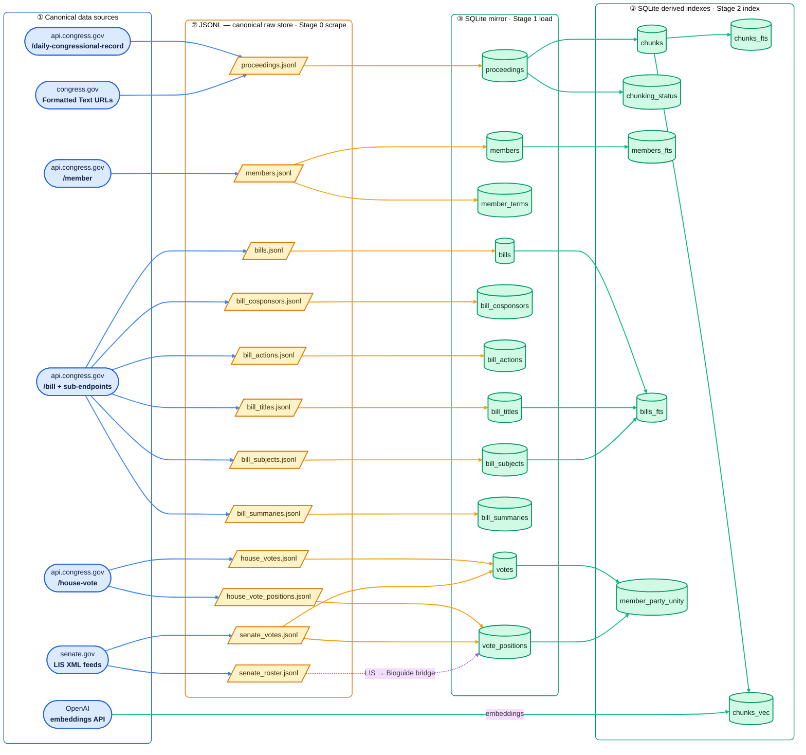

# Data overview

This document is the top-down view of every piece of data Concord ingests: what it represents, where it comes from, how it's keyed, whether it's mutable, where it lands on disk, and which design decisions govern those choices.

It is deliberately a *reference*, not a spec. The authoritative definitions live in:

- [CONTEXT.md](../CONTEXT.md) — the domain glossary (terms used verbatim in code).
- [src/concord/models.py](../src/concord/models.py) — the Pydantic models at the network boundary.
- [src/concord/storage/sqlite.py](../src/concord/storage/sqlite.py) — the SQL DDL for the derived store.
- [docs/adr/](adr/) — the non-obvious decisions referenced throughout.

## Pipeline at a glance

Data flows left-to-right through three stages: **Stage 0** scrapes canonical data sources into JSONL (the source of truth, [ADR 0002](adr/0002-jsonl-as-canonical-raw-store.md)); **Stage 1** loads those JSONL files into the SQLite mirror tables; **Stage 2** indexes the mirror into derived tables (chunks, FTS5, vectors, party-unity). Shape encodes the entity category — **rounded** = canonical data source, **slanted** = JSONL file, **cylinder** = SQLite table — and edge colour tracks the stage that produced it (blue scrape → amber load → green index). The OpenAI embeddings API is the one source that feeds a derived table directly rather than through JSONL.



Two flows are worth calling out: `members.jsonl` fans out into both `members` (identity) and `member_terms` (per-term party/state), and `senate_votes.jsonl` lands in both `votes` and `vote_positions`, with `senate_roster.jsonl` (the `senators_cfm.xml` snapshot) supplying the LIS-member-ID → Bioguide bridge that resolves Senate positions at load time ([ADR 0010](adr/0010-votes-phased-by-chamber.md)).

## Data sources

URL path placeholders used below: **`{c}`** = Congress number (e.g. `119`), **`{t}`** = Bill type code (e.g. `hr`), **`{n}`** = Bill number, **`{s}`** = session number (`1` or `2`), **`{roll}`** = roll-call number.

| Source | What we pull | Used for |
| --- | --- | --- |
| **govinfo.gov / api.congress.gov `/daily-congressional-record`** | Issue metadata + Article listings | Issues, Articles, Proceedings (the original scope) |
| **congress.gov "Formatted Text" URLs** | Plain text of each article | The `text` field on a Proceeding |
| **api.congress.gov `/member`** | Person + term history payloads | Members and their Terms |
| **api.congress.gov `/bill/{c}/{t}/{n}` + sub-endpoints** | Identity, cosponsors, actions, subjects, titles, summaries | Bills and their child rows |
| **api.congress.gov `/house-vote/{c}/{s}/{roll}`** | House roll-call metadata + per-member positions | Votes (House) and VotePositions |
| **senate.gov LIS XML feeds** | Senate roll-call metadata + per-member positions | Votes (Senate) and VotePositions, joined via `senators_cfm.xml` |
| **OpenAI embeddings API** | 1536-d vectors over chunks | Stage 2 vector index ([ADR 0004](adr/0004-openai-embeddings.md)) |

All HTTP clients live in [api.py](../src/concord/api.py), [text.py](../src/concord/text.py), and [senate_xml.py](../src/concord/senate_xml.py). Two env vars gate access: `CONGRESS_API_KEY` (required for any scrape) and `OPENAI_API_KEY` (required for indexing and `serve`). See [CLAUDE.md](../CLAUDE.md#api-keys).

## Mutability model

Two regimes coexist, by design ([ADR 0006](adr/0006-snapshot-on-fetch-for-mutable-entities.md)):

| Regime | Entities | JSONL row shape | Fetch contract |
| --- | --- | --- | --- |
| **Immutable** | Proceedings | Flat: one Proceeding per line | One line per `granule_id`, append-only |
| **Snapshot-on-fetch** | Members, Bills, Votes (and their child collections) | Envelope: `{"fetched_at", "key", "payload"}` | One line per *fetch*; many lines per natural key are normal |

For the snapshot regime, Stage 1 always projects "latest `fetched_at` per `key`" into SQLite. Mutability is about the *upstream object*, not about whether we ever rewrite a row — the SQLite mirror is freely upserted from whichever snapshot is latest, and either store can be rebuilt from the canonical JSONL.

Within the snapshot regime, multi-endpoint entities split further by sub-endpoint ([ADR 0009](adr/0009-multi-endpoint-entities-split-jsonl.md)): a Bill's identity, cosponsors, actions, subjects, titles, and summaries each live in their own `bill_*.jsonl` file. The Stage 1 loader joins them by `(congress, bill_type, bill_number)`.

## Storage layout

| Layer | Path | Role | ADR |
| --- | --- | --- | --- |
| Canonical raw store | `data/*.jsonl` | Source of truth; append-only; rebuildable target for SQLite | [0002](adr/0002-jsonl-as-canonical-raw-store.md) |
| Derived store | `data/proceedings.db` (SQLite + FTS5 + sqlite-vec) | Indexed, queryable mirror | [0003](adr/0003-sqlite-as-derived-store.md) |
| Alt raw backend | Mongo (optional) | Still works, not the default path; route new work through SQLite | [0003](adr/0003-sqlite-as-derived-store.md) |

The SQLite file holds Stage 1 mirrors *and* Stage 2 derived indexes in one place. `storage.sqlite.ensure_schema()` creates everything lazily; the web layer calls it on startup ([ADR 0012](adr/0012-web-bootstraps-empty-schema-on-startup.md)).

JSONL files written by Stage 0:

```
data/
  proceedings.jsonl                  # immutable, flat
  members.jsonl                      # snapshot envelope
  bills.jsonl                        # snapshot envelope — identity
  bill_cosponsors.jsonl              # snapshot envelope — one per fetch
  bill_actions.jsonl                 # snapshot envelope
  bill_subjects.jsonl                # snapshot envelope
  bill_titles.jsonl                  # snapshot envelope
  bill_summaries.jsonl               # snapshot envelope
  house_votes.jsonl                  # snapshot envelope — Vote metadata
  house_vote_positions.jsonl         # snapshot envelope — Vote positions
  senate_votes.jsonl                 # Senate detail XML, snapshot envelope
  senate_roster.jsonl                # senators_cfm.xml snapshot; LIS→Bioguide bridge
```

## Data dictionary

Tables below mirror the SQLite schema; bold columns are part of the primary key. "Mut." marks whether the *upstream* object is treated as mutable.

### Proceedings (immutable)

The original Congressional Record scope. One row per article.

**Table `proceedings`** &nbsp; · &nbsp; Mut.: no &nbsp; · &nbsp; Natural key: `granule_id`

| Column | Type | Description |
| --- | --- | --- |
| **granule_id** | TEXT PK | Stable ID like `CREC-2026-05-22-pt1-PgD551-6`; embedded in both text and PDF URLs |
| issue_date | TEXT | The calendar date (ISO `YYYY-MM-DD`) of the daily Congressional Record issue this article appeared in |
| congress | INT | The numbered Congress in session on `issue_date` (e.g. `119` for 2025–2026) |
| session | INT | Which half of the Congress (`1` for the odd-year session, `2` for the even-year session) |
| volume | INT | Bound-volume number of the Congressional Record this issue belongs to |
| issue_number | INT | The issue's sequential number within its `volume` |
| update_date | TEXT | Last-modified timestamp the upstream API reported for the issue metadata |
| section | TEXT | Top-level grouping within the issue: `Senate Section`, `House Section`, `Extensions of Remarks Section`, or `Daily Digest` |
| title | TEXT | Article title as it appears in the Congressional Record |
| start_page | TEXT | Page label where the article begins in the printed issue (a string because page labels include letters, e.g. `D551`) |
| end_page | TEXT | Page label where the article ends in the printed issue |
| text_url | TEXT | congress.gov URL for the article's "Formatted Text" rendering — the source of the `text` column |
| pdf_url | TEXT | congress.gov URL for the article's PDF rendering of the same content |
| text | TEXT | Plain text body of the article, fetched from `text_url` and stored verbatim |
| fetched_at | TEXT | ISO-8601 UTC timestamp recording when Concord pulled the article text |

### Members (mutable, snapshot)

**Table `members`** &nbsp; · &nbsp; Mut.: yes (rare metadata edits) &nbsp; · &nbsp; Natural key: `bioguide_id`

Identity fields only — anything that varies across a career lives on `member_terms`.

| Column | Type | Description |
| --- | --- | --- |
| **bioguide_id** | TEXT PK | Stable identifier assigned by the Biographical Directory of the United States Congress (e.g. `O000172`); never reused, never rewritten |
| first_name | TEXT | Member's given name |
| middle_name | TEXT | Member's middle name, when the upstream record carries one (nullable) |
| last_name | TEXT | Member's family name |
| suffix | TEXT | Generational or honorific suffix such as `Jr.` or `III`, when present (nullable) |
| birth_year | INT | Four-digit year of birth, when the upstream record carries one (nullable) |
| death_year | INT | Four-digit year of death; NULL for living Members |
| display_name | TEXT | Direct-order display string from the API's `directOrderName` (e.g. `Alexandria Ocasio-Cortez`) |
| photo_url | TEXT | URL of the Member's official portrait, taken from the API's `depiction.imageUrl` |
| biography | TEXT | Free-text biographical paragraph from the API, when present (nullable) |
| fetched_at | TEXT | ISO-8601 UTC timestamp of the most recent snapshot projected into this row |

**Table `member_terms`** &nbsp; · &nbsp; Mut.: yes &nbsp; · &nbsp; Natural key: `(bioguide_id, congress, chamber)`

One row per continuous service period in one chamber. Party and state are per-Term, not per-Member.

| Column | Type | Description |
| --- | --- | --- |
| **bioguide_id** | TEXT | Member this term belongs to; FK → `members.bioguide_id` |
| **congress** | INT | The numbered Congress this term covers (e.g. `118`) |
| **chamber** | TEXT | Which chamber the Member served in during this term: `house` or `senate` |
| party | TEXT | Party affiliation recorded for this term (e.g. `Democrat`, `Republican`, `Independent`); nullable when the upstream record omits it |
| state | TEXT | Two-letter postal code of the state or territory the Member represented in this term (e.g. `VT`, `PR`) |
| district | INT | House district number; NULL for senators and at-large representatives |
| start_date | TEXT | ISO `YYYY-MM-DD` when service began, clipped to the start of this Congress if the underlying career stretch began earlier |
| end_date | TEXT | ISO `YYYY-MM-DD` when service ended, clipped to the end of this Congress if the Member continued beyond it |

**Virtual `members_fts`** — FTS5 over `direct_order_name`, `inverted_order_name`, `last_name`.

### Bills (mutable, snapshot, multi-endpoint)

**Table `bills`** &nbsp; · &nbsp; Mut.: yes &nbsp; · &nbsp; Natural key: `(congress, bill_type, bill_number)` → flattened to `bill_id` = `"{congress}-{type}-{number}"` (e.g. `119-hr-1234`)

| Column | Type | Description |
| --- | --- | --- |
| **bill_id** | TEXT PK | Concord's flattened primary key for the Bill, shaped `"{congress}-{bill_type}-{bill_number}"` (e.g. `119-hr-1234`); matches the ADR 0008 `source_id` format |
| congress | INT | The numbered Congress in which the Bill was introduced |
| bill_type | TEXT | Bill-type code, canonicalized to lowercase; one of `hr`, `hres`, `hjres`, `hconres`, `s`, `sres`, `sjres`, `sconres` |
| bill_number | INT | The Bill's sequential number within `(congress, bill_type)` |
| origin_chamber | TEXT | Chamber where the Bill was introduced: `House` or `Senate` (note the capitalization is preserved from the API) |
| title | TEXT | Display title shown to users — the API's primary title for the Bill |
| introduced_date | TEXT | ISO `YYYY-MM-DD` the Bill was introduced; nullable when the upstream record omits it |
| policy_area | TEXT | Single CRS-assigned top-level subject (e.g. `Health`), distinct from the multi-valued legislative subjects in `bill_subjects` |
| sponsor_bioguide_id | TEXT | Bioguide ID of the sole sponsoring Member; stored as bare TEXT (no FK) so ingest tolerates a missing Member row |
| latest_action_date | TEXT | ISO `YYYY-MM-DD` of the most recent action recorded against the Bill |
| latest_action_text | TEXT | Free-text description of that most recent action (e.g. `Referred to the Committee on Foreign Relations`) |
| update_date | TEXT | Last-modified timestamp the upstream API reported for the Bill record |
| fetched_at | TEXT | ISO-8601 UTC timestamp of the most recent identity-endpoint snapshot projected into this row |
| cosponsors_fetched_at | TEXT | ISO-8601 UTC timestamp of the most recent cosponsors snapshot loaded into `bill_cosponsors`; NULL until the cosponsors loader has run |
| actions_fetched_at | TEXT | ISO-8601 UTC timestamp of the most recent actions snapshot loaded into `bill_actions`; NULL until the actions loader has run |
| subjects_fetched_at | TEXT | ISO-8601 UTC timestamp of the most recent subjects snapshot loaded into `bill_subjects`; NULL until the subjects loader has run |
| titles_fetched_at | TEXT | ISO-8601 UTC timestamp of the most recent titles snapshot loaded into `bill_titles`; NULL until the titles loader has run |
| summaries_fetched_at | TEXT | ISO-8601 UTC timestamp of the most recent summaries snapshot loaded into `bill_summaries`; NULL until the summaries loader has run |

**Child tables.** Each FKs to `bills.bill_id` with `ON DELETE CASCADE`, so wiping a Bill takes its enrichment with it.

**Table `bill_cosponsors`** &nbsp; · &nbsp; Natural key: `(bill_id, bioguide_id)` — one row per Member who has cosponsored the Bill.

| Column | Type | Description |
| --- | --- | --- |
| **bill_id** | TEXT | The Bill being cosponsored; FK → `bills.bill_id` |
| **bioguide_id** | TEXT | The cosponsoring Member; stored as bare TEXT (no FK) so a missing Member row doesn't break ingest |
| sponsorship_date | TEXT | ISO `YYYY-MM-DD` the Member added their name; nullable when the upstream record omits it |
| sponsorship_withdrawn_date | TEXT | ISO `YYYY-MM-DD` the Member withdrew their name; NULL means the cosponsorship is still active |
| is_original_cosponsor | INT | `1` if the cosponsor was on the Bill at introduction, `0` if they signed on later |

**Table `bill_actions`** &nbsp; · &nbsp; Natural key: `(bill_id, ord)` — one row per recorded event in the Bill's legislative history.

| Column | Type | Description |
| --- | --- | --- |
| **bill_id** | TEXT | The Bill the action belongs to; FK → `bills.bill_id` |
| **ord** | INT | Position of this action within the Bill's action list; preserves the upstream order so ties on `action_date` are stable |
| action_date | TEXT | ISO `YYYY-MM-DD` the action occurred |
| action_text | TEXT | Verbatim description of the action (e.g. `Passed House`, `Referred to the Committee on Foreign Relations`) |
| action_code | TEXT | Upstream code categorizing the action, when supplied; nullable |
| source_system | TEXT | Name of the originating system the action was reported by (e.g. `House`, `Library of Congress`); nullable |

**Table `bill_subjects`** &nbsp; · &nbsp; Natural key: `(bill_id, subject)` — one row per CRS-assigned legislative subject. Multi-valued, distinct from the single `policy_area` on `bills`.

| Column | Type | Description |
| --- | --- | --- |
| **bill_id** | TEXT | The Bill the subject is assigned to; FK → `bills.bill_id` |
| **subject** | TEXT | The CRS legislative subject string (e.g. `Medicare`, `Foreign aid and international relief`) |

**Table `bill_titles`** &nbsp; · &nbsp; Natural key: `(bill_id, ord)` — one row per title variant (display, official, short, popular).

| Column | Type | Description |
| --- | --- | --- |
| **bill_id** | TEXT | The Bill the title applies to; FK → `bills.bill_id` |
| **ord** | INT | Position of this title within the Bill's title list; preserves upstream order |
| title_type | TEXT | Category of the title as reported by the API (e.g. `Display Title`, `Official Title as Introduced`, `Short Title`, `Popular Title`) |
| title_text | TEXT | The title string itself |
| chamber | TEXT | Chamber the title is associated with, when the upstream record scopes the title to one chamber; nullable |

**Table `bill_summaries`** &nbsp; · &nbsp; Natural key: `(bill_id, version_code)` — one row per CRS-written summary version.

| Column | Type | Description |
| --- | --- | --- |
| **bill_id** | TEXT | The Bill the summary describes; FK → `bills.bill_id` |
| **version_code** | TEXT | CRS version code identifying which legislative stage the summary covers (e.g. `Introduced in House`, `Reported to Senate`) |
| action_date | TEXT | ISO `YYYY-MM-DD` of the legislative action this summary version describes; nullable |
| action_desc | TEXT | Free-text description of that action; nullable |
| summary_text | TEXT | The CRS-authored summary prose |

**Virtual `bills_fts`** — FTS5 over `identifier`, `title`, `policy_area`, `short_title`, `subjects`.

### Votes (mostly immutable but treated as snapshot)

**Table `votes`** &nbsp; · &nbsp; Mut.: rare errata only &nbsp; · &nbsp; Natural key: `(chamber, congress, session, roll_number)` → flattened to `vote_id` = `"{chamber}-{congress}-{session}-{roll}"`

| Column | Type | Description |
| --- | --- | --- |
| **vote_id** | TEXT PK | Concord's flattened primary key for the Vote, shaped `"{chamber}-{congress}-{session}-{roll}"` (e.g. `house-119-1-240`) |
| chamber | TEXT | Chamber that held the roll call: `house` or `senate` |
| congress | INT | The numbered Congress in which the vote took place |
| session | INT | Which half of the Congress the vote fell in: `1` (odd-year) or `2` (even-year) |
| roll_number | INT | The chamber's sequential roll-call number within `(congress, session)`; resets to 1 at the start of each session |
| vote_kind | TEXT | `standard` for ordinary Yea/Nay rolls; `election` for rolls where Members vote for a named candidate (e.g. Speaker election) |
| start_date | TEXT | ISO-8601 timestamp with timezone offset of when the roll call began |
| vote_question | TEXT | Free-text description of what was being decided (e.g. `On Passage of the Bill`, `Election of the Speaker`) — the source of truth for procedural votes that have no Bill or Amendment subject |
| vote_type | TEXT | Upstream free-text label categorizing the vote (e.g. `Yea-and-Nay`, `2/3 Yea-And-Nay`, `Recorded Vote`) |
| threshold | TEXT | Normalized passing threshold derived from `vote_type`: `simple_majority`, `two_thirds`, `three_fifths`, or NULL when no rule could be inferred |
| result | TEXT | Outcome string as reported by the upstream API (e.g. `Passed`, `Failed`) |
| yea_count | INT | Total Yea votes cast; NULL for `election` votes (which bucket by candidate, not by Yea/Nay) |
| nay_count | INT | Total Nay votes cast; NULL for `election` votes |
| present_count | INT | Total Present (non-position) votes cast; NULL for `election` votes |
| not_voting_count | INT | Total Members recorded as not voting; NULL for `election` votes |
| bill_id | TEXT | Concord `bill_id` of the Bill the vote was about, when applicable; stored as bare TEXT (no FK) so ingest tolerates a missing Bills row; NULL for procedural votes |
| amendment_id | TEXT | Concord-flattened Amendment ID (`"{congress}-{type}-{number}"`) when the vote was on an amendment; NULL otherwise. Both `bill_id` and `amendment_id` can be populated together for an amendment vote on a specific Bill |
| is_party_unity | INT | `1` if this is a party-unity vote (a majority of one major party opposed a majority of the other); `0` otherwise. Denormalized for join-free filtering and populated by the Stage 2 indexer |
| update_date | TEXT | Last-modified timestamp the upstream API reported for the vote record |
| fetched_at | TEXT | ISO-8601 UTC timestamp of the most recent snapshot projected into this row |

**Table `vote_positions`** &nbsp; · &nbsp; Natural key: `(vote_id, bioguide_id)`

| Column | Type | Description |
| --- | --- | --- |
| **vote_id** | TEXT | The Vote this position belongs to; matches `votes.vote_id` |
| **bioguide_id** | TEXT | The Member whose position is recorded; matches `members.bioguide_id` (stored as bare TEXT so a missing Member row doesn't block ingest) |
| position | TEXT | The Member's choice on the roll: for `standard` votes, one of `Yea` / `Nay` / `Present` / `Not Voting`; for `election` votes, the surname of the candidate the Member voted for |
| vote_party | TEXT | Party the Member was recorded under at vote time, denormalized off the API payload so party-unity computation doesn't have to join `member_terms` |
| vote_state | TEXT | State the Member was recorded under at vote time, denormalized off the API payload |

Votes are ingested through one pipeline per chamber, not split by metadata-vs-positions ([ADR 0010](adr/0010-votes-phased-by-chamber.md)): House votes come from api.congress.gov, Senate votes from senate.gov LIS XML. The Senate detail XML keys positions by **LIS member ID**, not Bioguide; resolution happens at load time using `senators_cfm.xml` as the bridge — see `member_full` and `lis_member_id` in [CONTEXT.md](../CONTEXT.md).

### Derived: Chunks and indexes

**Table `chunks`** &nbsp; · &nbsp; Unit of retrieval ([ADR 0005](adr/0005-chunks-as-unit-of-retrieval.md), [ADR 0008](adr/0008-chunks-generalize-beyond-proceedings.md))

Currently FKs to `proceedings.granule_id`; ADR 0008 establishes that this single `chunks` table is the home for chunks from *all* source types (Bills, Votes, …) discriminated by `(source_type, source_id, ord)`.

| Column | Type | Description |
| --- | --- | --- |
| **id** | INT PK | Autoincrement integer that uniquely identifies the chunk; the row ID FTS5 and `chunks_vec` both key on |
| granule_id | TEXT | Proceeding this chunk was sliced from; FK → `proceedings.granule_id` with `ON DELETE CASCADE` |
| chunk_index | INT | Zero-based position of this chunk within the source's chunk sequence |
| text | TEXT | The chunk's text content — a span of the source sized for a single embedding |
| char_start | INT | Inclusive character offset where this chunk begins within the source's full text |
| char_end | INT | Exclusive character offset where this chunk ends within the source's full text |

**`chunks_fts`** — FTS5 virtual table over `chunks.text`, external-content mode (chunks owns the bytes). BM25 ranking, snippets, phrase queries.

**`chunks_vec`** — `sqlite-vec` virtual table holding 1536-d OpenAI embeddings keyed on `chunks.id`. Only created when `load_vec=True`. Cascade-delete trigger keeps it aligned with `chunks`.

**`chunking_status`** — records every Proceeding whose text has been *considered* for chunking, including those whose text produced zero chunks. Without it, "find unchunked proceedings" would loop forever over empty-text rows.

Hybrid keyword + semantic search combines FTS5 and vec ranks via Reciprocal Rank Fusion (RRF).

### Derived: Party Unity Score

**Table `member_party_unity`** &nbsp; · &nbsp; Natural key: `(bioguide_id, congress, chamber)`

Computed by the Stage 2 indexer; truncated and repopulated each run. CQ-style methodology, chamber-scoped ([ADR 0011](adr/0011-party-unity-score-methodology.md)). Independents are excluded by the `party IN ('R', 'D')` constraint; the UI shows a separate muted treatment.

| Column | Type | Description |
| --- | --- | --- |
| **bioguide_id** | TEXT | The Member the score is computed for; matches `members.bioguide_id` |
| **congress** | INT | The numbered Congress the score covers — scores are not pooled across Congresses |
| **chamber** | TEXT | The chamber the score is scoped to: `house` or `senate`. Scoring is chamber-local so House and Senate majorities aren't mixed |
| party | TEXT | The Member's party for this `(congress, chamber)`: `R` or `D` only (Independents are excluded from the table by CHECK constraint) |
| party_unity_votes_cast | INT | Denominator: the count of party-unity votes on which the Member cast a Yea or Nay during this `(congress, chamber)` |
| party_line_votes | INT | Numerator: of those, the count where the Member voted with their party's majority. Party-Unity Score is `party_line_votes / party_unity_votes_cast` |

## Pipeline stages — where data is shaped

Stages are *modules*, not classes ([ADR 0007](adr/0007-parallel-pipelines-per-entity.md)). Each entity has its own scrape/load/index pair; shared utilities live in thin `_common.py` helpers.

| Stage | What it does | Inputs | Outputs |
| --- | --- | --- | --- |
| **Stage 0 — Scrape** | Pull from upstream APIs, write canonical JSONL | HTTP | `data/*.jsonl` |
| **Stage 1 — Load** | Project canonical JSONL into SQLite mirror tables | `data/*.jsonl` | SQLite tables above |
| **Stage 2 — Index** | Build chunks, FTS5, vec index, party-unity scores | SQLite mirror | `chunks`, `chunks_fts`, `chunks_vec`, `member_party_unity` |

Every command is idempotent — natural-key dedup makes re-runs no-ops.

## Cross-cutting decisions worth knowing

- **JSONL is canonical.** SQLite is rebuildable from it. Writing data only to SQLite breaks ADR 0002. ([0002](adr/0002-jsonl-as-canonical-raw-store.md))
- **SQLite + FTS5 + sqlite-vec is the default derived store**, not Postgres / DuckDB / Mongo. ([0003](adr/0003-sqlite-as-derived-store.md))
- **OpenAI provides embeddings** rather than a local model. ([0004](adr/0004-openai-embeddings.md))
- **Chunks are the unit of retrieval** and span source types in one shared table. ([0005](adr/0005-chunks-as-unit-of-retrieval.md), [0008](adr/0008-chunks-generalize-beyond-proceedings.md))
- **Mutable entities use snapshot-on-fetch.** Proceedings use a flat row shape instead — the two regimes coexist by design and aren't unified. ([0006](adr/0006-snapshot-on-fetch-for-mutable-entities.md))
- **Pipelines are parallel per entity, not a generic framework.** ([0007](adr/0007-parallel-pipelines-per-entity.md))
- **Multi-endpoint entities (Bills) split their JSONL by sub-endpoint.** ([0009](adr/0009-multi-endpoint-entities-split-jsonl.md))
- **Votes are ingested per chamber**, with different upstream sources for House and Senate. ([0010](adr/0010-votes-phased-by-chamber.md))
- **Party Unity Score uses the CQ Almanac methodology**, chamber-scoped. ([0011](adr/0011-party-unity-score-methodology.md))
- **The web layer bootstraps an empty SQLite schema on startup**, so `concord serve` doesn't require a populated DB. ([0012](adr/0012-web-bootstraps-empty-schema-on-startup.md))

## Presentation layer

The web app (FastAPI + Jinja2 + HTMX, single Python process — [ADR 0001](adr/0001-python-end-to-end-for-the-web-layer.md)) reads the same SQLite the pipeline writes. WAL mode is enabled so the web layer can read concurrently while the pipeline writes. Search routes use hybrid keyword + semantic ranking against `chunks_fts` + `chunks_vec`, fused by RRF; result rows roll back up to whichever source type owns the chunk for display.
