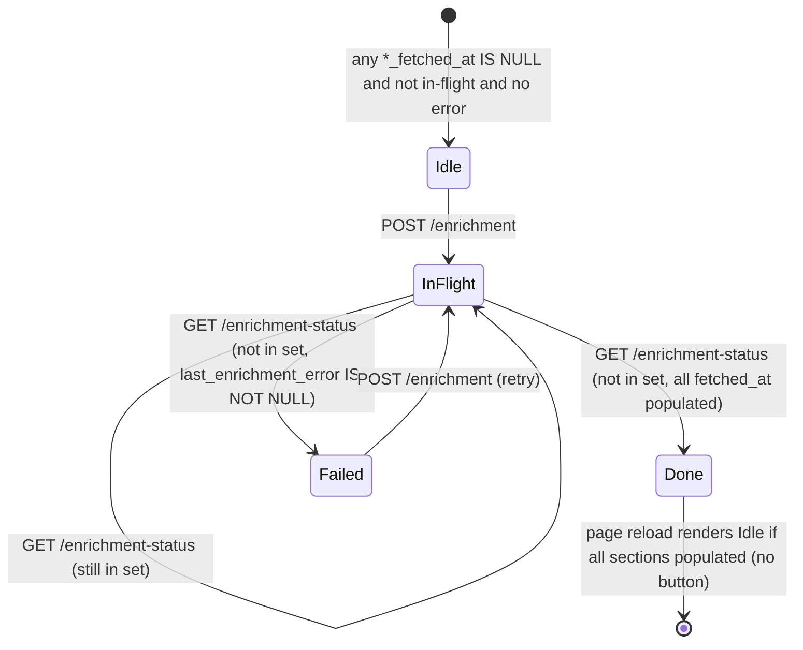

# Bill enrichment button (web-initiated Stage 0 → 1 → 2)

> Add a single "Request enrichment" button at the top of every Bill profile page that runs the tier-2 enrichment pipeline for that one bill — `scrape_enrichment` → `load_bills.load_one` → `index_bills.reindex_one` — in a fire-and-forget background task, with HTMX-polled status, off by default behind an env-var kill switch and an explicit chokepoint for the follow-up rate-limit plan.

## Source

Conversation context, 2026-05-27. The user described wanting a web affordance for what `concord scrape bills enrich --bill-ids <id>` does from the CLI today. The grilling session for this plan resolved seven design branches; see [Approach](#approach) for the resulting decisions. (No durable issue/RFC; this paraphrase is the only source. A GitHub issue will be filed pointing at this plan as the durable record.)

## Context

Concord's pipeline has three stages for Bills today:

- **Stage 0 — Scrape.** [`src/concord/scraper/bills.py`](../../src/concord/scraper/bills.py) exposes `scrape_basic` (one-time tier-1 walk) and `scrape_enrichment` (per-bill tier-2 walk over five sub-endpoints: cosponsors / actions / subjects / titles / summaries — see [ADR 0009](../adr/0009-multi-endpoint-entities-split-jsonl.md)). Writes JSONL snapshots per [ADR 0006](../adr/0006-snapshot-on-fetch-for-mutable-entities.md).
- **Stage 1 — Load.** [`src/concord/pipeline/load_bills.py`](../../src/concord/pipeline/load_bills.py) projects all six JSONL files into the `bills` row + five child tables, stamping the per-section `*_fetched_at` columns.
- **Stage 2 — Index.** [`src/concord/pipeline/index_bills.py`](../../src/concord/pipeline/index_bills.py) rebuilds the `bills_fts` FTS5 virtual table; aggregates the bill's first short title and its subjects so `/search` matches on them.

The Bill profile page ([`src/concord/web/templates/bills/profile.html`](../../src/concord/web/templates/bills/profile.html)) already renders five tier-2 sections (cosponsors, action history, subjects, titles, summaries). Each section has a dashed-box "not yet fetched — run `concord scrape bills enrich --bill-ids {bill_id}`" placeholder when its `*_fetched_at` column is NULL. This plan replaces that CLI-invocation hint with an in-page action button (when enabled) that runs the same pipeline from the web process.

The web layer today is a **pure reader** of the derived SQLite store. It does not import `concord.api.Client`, does not read `CONGRESS_API_KEY`, and has no background-task scaffolding. Letting it kick off enrichment makes it (directly) a writer to the JSONL canonical store — a meaningful framing shift relative to [ADR 0007](../adr/0007-parallel-pipelines-per-entity.md). That shift is captured in **ADR 0016** (new, drafted as a step of this plan).

[Phase 2b explicitly deferred this work](./phase-2b-bills-enrichment.md#out-of-scope) because no background-task framework existed in the codebase. This plan resolves the deferral by leaning on `fastapi.BackgroundTasks` rather than a real task queue — see [Approach](#approach) for the reasoning.

Domain terms used here are defined in [CONTEXT.md](../../CONTEXT.md): Bill, Bill ID, Bill type, Cosponsor, Bill action, Policy area, Chamber.

## Goals

1. Add `POST /bills/{congress}/{bill_type}/{bill_number}/enrichment` to the FastAPI app. The handler dispatches a background task that runs `scrape_enrichment` → `load_bills.load_one` → `index_bills.reindex_one` for the one bill and returns an HTMX in-flight fragment immediately (HTTP 200, not 202 — HTMX is happier with 200).
2. Add `GET /bills/{congress}/{bill_type}/{bill_number}/enrichment-status` returning an HTMX fragment with one of four states: **idle** (button visible), **in-flight** (polling 3s), **done** (button hidden, triggers section-content refresh), **failed** (error banner + "Try again" button).
3. Add a "Request enrichment" button to the top of [`src/concord/web/templates/bills/profile.html`](../../src/concord/web/templates/bills/profile.html). The button renders only when both `CONGRESS_API_KEY` and `CONCORD_ENABLE_WEB_ENRICHMENT` are set in the environment of the web process.
4. Factor a `reindex_one(*, db_path, bill_id)` helper out of [`src/concord/pipeline/index_bills.py`](../../src/concord/pipeline/index_bills.py)'s bulk `index()` so the request flow's FTS update is O(1) per bill rather than O(N).
5. Factor a `load_one(*, storage_dir, db_path, bill_id)` helper out of [`src/concord/pipeline/load_bills.py`](../../src/concord/pipeline/load_bills.py)'s bulk `load()` so the request flow's projection is O(1) per bill rather than O(N).
6. Add an in-process `set[str]` of in-flight `bill_id`s plus an `asyncio.Lock` on `app.state` for cross-request de-dup.
7. Add a `bills.last_enrichment_error TEXT NULL` column to the SQLite schema. Cleared at the start of every enrichment attempt; written on any failure path.
8. Draft **ADR 0016 — Web layer may invoke Stage 0 enrichment on demand** at [`docs/adr/0016-web-initiated-enrichment.md`](../adr/0016-web-initiated-enrichment.md). Documents the framing shift relative to ADR 0007, the choice of `BackgroundTasks` over a real queue, the in-process lock and its single-worker assumption, and that rate limiting is the subject of a follow-up.

## Non-goals

1. **Rate limiting.** A separate plan and a separate ADR. This plan names the chokepoint — the `POST …/enrichment` handler — and arranges the in-flight check so it runs *after* any future `@limiter.limit(...)` decorator. No placeholder decorator, no commented-out limit string.
2. **Bills embeddings (Phase 5).** `index_bills` is FTS-only today; embeddings for bills are deferred. The new `reindex_one` mirrors that scope.
3. **Per-section buttons / section checkboxes.** Considered and rejected in grilling. One button, all five sections.
4. **Real task queue (Celery / RQ / arq / Dramatiq).** Adds a Redis dependency and a worker process to what is currently a single-process FastAPI demo. Rejected; see ADR 0016.
5. **Multi-worker uvicorn correctness.** The in-process lock is correct only for `uvicorn` with `--workers 1` (the current shape of `concord serve`). Documented as a known limitation in ADR 0016.
6. **Auth / login / per-user quotas.** The app is anonymous. The env-var kill switch is the v1 access control. Per-user quotas are not a goal until the app has users.
7. **Automatic retries inside the background task.** The user retries by clicking. Simpler, cooperates naturally with the future per-IP limiter.
8. **A schema version / migration story for the new column.** [ADR 0012](../adr/0012-web-bootstraps-empty-schema-on-startup.md) flagged that "no `schema_version` check yet" is acceptable while DDL is append-only. Adding one nullable column stays inside that contract.

## Relevant prior decisions

- [ADR 0001 — Python end-to-end for the web layer](../adr/0001-python-end-to-end-for-the-web-layer.md). The "no separate worker process" preference is the reason this plan picks `BackgroundTasks` over a real task queue.
- [ADR 0002 — JSONL as canonical raw store](../adr/0002-jsonl-as-canonical-raw-store.md). Append-only JSONL is what makes the "user re-clicks; up to 5 duplicate envelopes; loader dedups" failure model cheap.
- [ADR 0006 — Snapshot-on-fetch for mutable entities](../adr/0006-snapshot-on-fetch-for-mutable-entities.md). Each enrichment fetch appends one snapshot envelope per (bill, section).
- [ADR 0007 — Parallel pipelines per entity](../adr/0007-parallel-pipelines-per-entity.md). The relevant framing: Stage 0 is the scraper. ADR 0016 (new) records the expansion to "the web layer may also run Stage 0 enrichment on demand".
- [ADR 0009 — Multi-endpoint entities split their JSONL canonical store by sub-endpoint](../adr/0009-multi-endpoint-entities-split-jsonl.md). Defines the five `bill_<section>.jsonl` files this plan writes to.
- [ADR 0012 — Web layer bootstraps an empty schema on startup](../adr/0012-web-bootstraps-empty-schema-on-startup.md). Schema-of-record lives in `storage/sqlite.py`. The new `bills.last_enrichment_error` column goes there.
- [`docs/plans/phase-2b-bills-enrichment.md`](./phase-2b-bills-enrichment.md). The plan that built the enrichment scraper, loader, and the section placeholders this plan now wires a button into; explicitly deferred web-initiated enrichment.
- **ADR 0016 — Web layer may invoke Stage 0 enrichment on demand** (new, created with this plan). See [Step 9](#step-by-step-plan).
- [`docs/plans/enrichment-rate-limiting.md`](./enrichment-rate-limiting.md). Sibling plan that adds the `@limiter.limit(...)` decorator on the POST handler this plan creates, and **introduces `src/concord/config.py` with a pydantic-settings `Settings` class** that this plan's Step 5 consumes. The two plans must land together (or this plan's Step 5 depends on the rate-limit plan's Steps 1–4 landing first).

## Relevant files and code

- [`src/concord/scraper/bills.py:222`](../../src/concord/scraper/bills.py) — `scrape_enrichment(client, bill_keys, storage_dir, *, fetched_at, sections=None, limit=None, progress=None)`. Per-section try/except (lines 273–288) already absorbs individual failures; the function returns even if 0–5 sections succeeded. No changes needed in this file.
- [`src/concord/pipeline/load_bills.py:62`](../../src/concord/pipeline/load_bills.py) — `load(*, storage_dir, db_path, limit=None)`. Full-table projection. This plan factors `load_one(...)` out of the existing per-bill loop body (see [`_ingest_tier1`](../../src/concord/pipeline/load_bills.py) and the tier-2 loop at line 106).
- [`src/concord/pipeline/index_bills.py:31`](../../src/concord/pipeline/index_bills.py) — `index(*, db_path, limit=None)`. Full-table FTS rebuild. This plan factors `reindex_one(...)` out of the per-row body (lines 41–72).
- [`src/concord/api.py:114`](../../src/concord/api.py) — `Client(api_key=None)`. Reads `CONGRESS_API_KEY` if `api_key` not passed; raises `ApiError` if absent.
- [`src/concord/web/app.py:98`](../../src/concord/web/app.py) — `create_app(db_path, *, embedder=None)`. The boot-time env-var sniff and the `enrichment_in_flight` / `enrichment_lock` `app.state` attributes go in here.
- [`src/concord/web/app.py:152`](../../src/concord/web/app.py) — `_register_routes(app, limiter)`. The two new routes are conditionally registered here (only when enrichment is enabled).
- [`src/concord/web/app.py:426`](../../src/concord/web/app.py) — `bills_profile` route. The context dict it builds will gain `enrichment_enabled` and `enrichment_state` keys.
- [`src/concord/web/templates/bills/profile.html`](../../src/concord/web/templates/bills/profile.html) — adds the button-or-status fragment block at the top of the `md:col-span-3` content column, above the "Latest action" section.
- [`src/concord/web/templates/bills/`](../../src/concord/web/templates/bills/) — new partials: `_enrichment_button.html`, `_enrichment_in_flight.html`, `_enrichment_done.html`, `_enrichment_failed.html`. (One file per state keeps each tiny and HTMX-swappable in isolation.)
- [`src/concord/storage/sqlite.py:205`](../../src/concord/storage/sqlite.py) — the `bills` table DDL. The new `last_enrichment_error TEXT NULL` column goes alongside the existing `cosponsors_fetched_at` line.
- [`tests/test_pipeline_bills.py`](../../tests/test_pipeline_bills.py) — existing per-bill loader / indexer tests; new `load_one` / `reindex_one` cases go in the same file.
- [`tests/test_web_bills.py`](../../tests/test_web_bills.py) — existing FastAPI route tests for the bills section; new tests for the three new routes (POST + status GET in three states) and the env-var gating go in the same file.

## Approach

### Top-of-page button, not per-section

The five existing "not yet fetched — run …" placeholders stay as the fallback for the non-enrichment-enabled deployment. When enrichment is enabled, a single button-or-status fragment appears above the "Latest action" section and applies to all five tier-2 sections at once. Per-section buttons were considered and rejected — `scrape_enrichment` defaults to all five sections, the existing CLI command does all five together, and the cost asymmetry (summaries dominate) is something an operator can mitigate via the CLI; it isn't worth five buttons in the UI.

### Fire-and-forget via `BackgroundTasks`, not a real queue

The work is 5 sub-endpoint calls + one set of UPSERTs + one single-row FTS update — typically a few seconds, occasionally tens of seconds for a heavily-cosponsored bill with paginated actions. Long enough that blocking the HTTP request is the wrong shape (proxy timeouts; bad demo feel); short enough that a real task queue with Redis is overkill for a single-process FastAPI demo. `fastapi.BackgroundTasks` is the middle road: zero new dependencies, runs in-process, and `asyncio.to_thread` keeps the synchronous scraper / loader / indexer off the event loop.

Crash-mid-job semantics: the in-process in-flight set evaporates on restart; the user re-clicks; `scrape_enrichment` re-runs all five sections; the JSONL gains up to 5 duplicate envelopes, all swallowed by the loader's natural-key dedup (existing behavior per [ADR 0002](../adr/0002-jsonl-as-canonical-raw-store.md)). End state is correct.

### In-process lock, single-worker assumption

`app.state.enrichment_in_flight: set[str]` and `app.state.enrichment_lock: asyncio.Lock`. The handler acquires the lock, checks membership, adds, releases. The background task removes from the set in a `finally:` block. Multi-worker uvicorn would need a SQLite-backed `enrichment_jobs` table; that's a future change, gated on a real deployment shape we don't have yet. ADR 0016 names the revisit trigger.

### Status state machine and HTMX poll



The button POST returns the in-flight fragment with `hx-get=".../enrichment-status" hx-trigger="every 3s" hx-swap="outerHTML"`. The status GET returns the same in-flight fragment while the bill is in the set; otherwise it returns the done or failed fragment. The done fragment carries `hx-trigger="load"` on hidden `hx-get` directives that swap the five section bodies with fresh content; the failed fragment carries a "Try again" button that POSTs to `/enrichment`.

"Done" state is the conjunction `bill_id not in in_flight AND all(*_fetched_at IS NOT NULL)`. "Failed" is `bill_id not in in_flight AND last_enrichment_error IS NOT NULL`. Partial success (3 of 5 sections fetched) reports as "Done" — the per-section UI already shows "not yet fetched" for the NULL columns, so a re-click naturally retries the still-NULL ones.

### Pipeline calls scoped to one bill

`load_bills.load(...)` and `index_bills.index(...)` are both O(N) over all bills today. Calling them on every button click would scale poorly as bills count grows past ~100K. New helpers:

- `load_bills.load_one(*, storage_dir, db_path, bill_id)` — reads only the snapshots for `bill_id` from `bills.jsonl` and the five sibling files, UPSERTs the bill row, DELETEs+INSERTs the five child tables.
- `index_bills.reindex_one(*, db_path, bill_id)` — DELETEs the matching `bills_fts` row by `rowid` (joined to the `bills` row by `bill_id`), then re-INSERTs the one row with the same SELECT shape as the bulk path.

Both factor out logic from the existing bulk functions; the bulk functions are refactored to call the per-bill helper in their inner loop. Bulk behavior is unchanged.

### Env-var gating

Two gates:

- `CONGRESS_API_KEY` present → enrichment is *possible*. Used at boot to stash `app.state.has_congress_api_key: bool`.
- `CONCORD_ENABLE_WEB_ENRICHMENT` present and truthy ("1" / "true" / "yes", case-insensitive) → enrichment is *offered*. Used at boot to stash `app.state.enrichment_enabled: bool`.

Both must be true for the button to render and the two new routes to be registered. When disabled, the routes don't exist (404, not 403) and the existing per-section CLI-hint placeholders are unchanged. This means a public-demo deployment without the kill-switch can't be coaxed into running enrichment even by hand-crafting the POST URL.

### The new ADR

ADR 0016 records:
- Web process becomes a writer to the JSONL canonical store; this is an expansion of, not a violation of, ADR 0007. The CLI scraper remains the primary writer.
- Rationale for `BackgroundTasks` over a real queue.
- Rationale for in-process lock; revisit trigger ("when we deploy multi-worker").
- Rate limiting is deferred to a separate plan and a separate ADR; this ADR names the chokepoint.
- Why the button is gated on a second env var beyond `CONGRESS_API_KEY` (defense in depth; the limiter is the other layer).

## Step-by-step plan

1. **Add the `bills.last_enrichment_error` column.** Edit [`src/concord/storage/sqlite.py:205`](../../src/concord/storage/sqlite.py) to add `last_enrichment_error TEXT NULL` to the `bills` CREATE TABLE statement, on the line after `summaries_fetched_at TEXT,`. The DDL is already `CREATE … IF NOT EXISTS` and append-only across releases (per ADR 0012), so existing DBs need no migration step beyond running `ensure_schema` on next boot. **Verify:** `uv run pytest tests/test_storage_sqlite.py -x` passes; `sqlite3 :memory: < schema.sql` round-trip in a quick Python REPL shows the new column.

2. **Add storage helpers for the error column.** In `storage/sqlite.py`, add two methods to `SqliteStorage`: `set_bill_enrichment_error(bill_id: str, error: str) -> None` (one-line UPDATE) and `clear_bill_enrichment_error(bill_id: str) -> None` (UPDATE … SET last_enrichment_error = NULL). Mirror the style of the existing per-section `*_fetched_at` setters. **Verify:** add two tests to [`tests/test_storage_sqlite.py`](../../tests/test_storage_sqlite.py) round-tripping set / read / clear.

3. **Factor `load_one` out of `load_bills.load`.** In [`src/concord/pipeline/load_bills.py`](../../src/concord/pipeline/load_bills.py), add `load_one(*, storage_dir, db_path, bill_id: str) -> LoadStats` that:
   (a) parses `bill_id` into `(congress, bill_type, bill_number)` (the format is `"<c>-<t>-<n>"` per [CONTEXT.md](../../CONTEXT.md));
   (b) streams `bills.jsonl` and keeps only the latest snapshot whose key matches; UPSERTs that one bill if found;
   (c) for each of the five tier-2 sections, streams `bill_<section>.jsonl`, filters to envelopes with the matching key, runs the existing `_project_<section>` helper inside one transaction.
   Refactor the bulk `load(...)` to share the per-bill projection code with `load_one(...)` (extract a private `_project_one_bill(storage, bill_id, payloads_by_section)` helper). **Verify:** `uv run pytest tests/test_pipeline_bills.py -x` still passes; new test `test_load_one_projects_only_the_named_bill` covers the filter behavior and confirms re-running `load_one` against unchanged JSONL is a no-op (idempotent).

4. **Factor `reindex_one` out of `index_bills.index`.** In [`src/concord/pipeline/index_bills.py`](../../src/concord/pipeline/index_bills.py), add `reindex_one(*, db_path, bill_id: str) -> None` that runs the existing per-row SELECT + DELETE-by-rowid + INSERT against just the one `bills` row matching `bill_id`. Refactor `index(...)`'s body so the per-row work is a call to a private `_reindex_one_with_conn(conn, bill_id)` shared with the new public function. **Verify:** `uv run pytest tests/test_pipeline_bills.py -x` still passes; new test `test_reindex_one_updates_only_one_fts_row` covers the scoping.

5. **Construct `Settings` and stash enrichment state on `app.state`.** This step depends on `src/concord/config.py` existing — see [enrichment-rate-limiting.md](./enrichment-rate-limiting.md) Steps 1–2. In [`src/concord/web/app.py`](../../src/concord/web/app.py), inside `create_app(...)` after `ensure_schema(db_path)` and before the `limiter = Limiter(...)` line, add:
   ```python
   from concord.config import Settings
   settings = Settings()
   enrichment_enabled = bool(settings.congress_api_key) and settings.enable_web_enrichment
   ```
   Stash `settings` and `enrichment_enabled` on `app.state`. Also stash `app.state.enrichment_in_flight: set[str] = set()` and `app.state.enrichment_lock = asyncio.Lock()` (these are created unconditionally — the routes that consume them are conditionally registered). **Verify:** boot the app via `uv run concord serve` with and without each env var; assert `app.state.enrichment_enabled` matches via a test that constructs the app with monkey-patched env.

6. **Add the `POST /bills/.../enrichment` route, conditionally registered.** In `_register_routes(...)`, inside `if app.state.enrichment_enabled:`, register a `@app.post("/bills/{congress}/{bill_type}/{bill_number}/enrichment", response_class=HTMLResponse)` handler that:
   (a) validates `bill_type` against `_VALID_BILL_TYPES` and returns 404 otherwise;
   (b) constructs `bill_id = f"{congress}-{bill_type.lower()}-{bill_number}"`;
   (c) acquires `app.state.enrichment_lock`, checks `bill_id in app.state.enrichment_in_flight`:
       - if present → release lock, return the in-flight fragment without enqueuing;
       - if absent → add to set, release lock, call `background_tasks.add_task(_enrich_one_bill, app, bill_id)`, return the in-flight fragment.
   The handler is the named chokepoint for the future rate-limit plan; the in-flight check sits *inside* the handler so a 429 from a future limiter decorator returns before any state mutation. **Verify:** add `test_post_enrichment_returns_in_flight_fragment` to [`tests/test_web_bills.py`](../../tests/test_web_bills.py) hitting the route with the env vars set in the test fixture; assert the response HTML contains `hx-get` for the status URL.

7. **Add the background-task body.** In `src/concord/web/app.py` (module-level helper, not inside `_register_routes`), define `def _enrich_one_bill(app: FastAPI, bill_id: str) -> None`. Body:
   ```python
   from concord.api import Client
   from concord.scraper.bills import scrape_enrichment, BILL_ENRICHMENT_SECTIONS
   from concord.pipeline import load_bills, index_bills
   storage = SqliteStorage(app.state.db_path, load_vec=False)
   try:
       storage.clear_bill_enrichment_error(bill_id)
   finally:
       storage.close()
   try:
       congress_s, bill_type, bill_number_s = bill_id.split("-")
       key = (int(congress_s), bill_type, int(bill_number_s))
       with Client() as client:
           scrape_enrichment(
               client,
               [key],
               app.state.storage_dir,
               fetched_at=datetime.now(UTC),
           )
       load_bills.load_one(storage_dir=app.state.storage_dir, db_path=app.state.db_path, bill_id=bill_id)
       index_bills.reindex_one(db_path=app.state.db_path, bill_id=bill_id)
   except Exception as exc:
       storage = SqliteStorage(app.state.db_path, load_vec=False)
       try:
           storage.set_bill_enrichment_error(bill_id, str(exc)[:500])
       finally:
           storage.close()
   finally:
       app.state.enrichment_in_flight.discard(bill_id)
   ```
   The body runs synchronously inside `BackgroundTasks`; FastAPI runs sync functions registered via `add_task` in a threadpool, so the event loop is not blocked. `app.state.storage_dir` is a new attribute set in `create_app` (Step 8). **Verify:** add an integration test that monkeypatches `concord.api.Client` to a stub and `scrape_enrichment` to a no-op-ish double that touches the JSONL, kicks off one enrichment via the route, awaits a brief async wait, and asserts the SQLite row's `*_fetched_at` columns and `last_enrichment_error` are as expected.

8. **Expose `storage_dir` to the web app.** `create_app(...)` currently takes `db_path` only; the background task also needs the JSONL directory. Two options: add a `storage_dir: Path | None = None` parameter (defaults to `db_path.parent / "data"` or similar — verify against the conventional layout) **or** make it a third positional. Pick the parameter form. Wire it through [`src/concord/cli/serve.py`](../../src/concord/cli/serve.py)'s `serve_command`. **Verify:** `uv run concord serve --help` still renders; existing app tests still pass.

9. **Add the `GET /bills/.../enrichment-status` route, conditionally registered.** Same registration condition as Step 6. Handler reads `app.state.enrichment_in_flight`, `*_fetched_at` columns, and `last_enrichment_error` from the bills row to pick one of three fragments to return: `bills/_enrichment_in_flight.html`, `bills/_enrichment_done.html`, or `bills/_enrichment_failed.html`. Idle is not returned from this endpoint — idle is what the profile page renders directly. **Verify:** add `test_enrichment_status_in_flight`, `test_enrichment_status_done`, `test_enrichment_status_failed` to [`tests/test_web_bills.py`](../../tests/test_web_bills.py), each setting the precondition state explicitly.

10. **Add the four HTMX partials.** Create:
    - [`src/concord/web/templates/bills/_enrichment_button.html`](../../src/concord/web/templates/bills/_enrichment_button.html) — a `<button hx-post="/bills/{c}/{t}/{n}/enrichment" hx-target="#enrichment-status" hx-swap="outerHTML">Request enrichment</button>` wrapped in `<div id="enrichment-status">`.
    - `_enrichment_in_flight.html` — a `<div id="enrichment-status" hx-get="/bills/{c}/{t}/{n}/enrichment-status" hx-trigger="every 3s" hx-swap="outerHTML">Enriching this bill…</div>` plus a small spinner / dimmed text.
    - `_enrichment_done.html` — a `<div id="enrichment-status" hx-get="/bills/{c}/{t}/{n}" hx-trigger="load" hx-target="body" hx-swap="outerHTML">Enrichment complete. Refreshing…</div>`. (Simpler than five per-section hidden swaps: one full page swap on completion.)
    - `_enrichment_failed.html` — a `<div id="enrichment-status">⚠ Enrichment failed: {{ error|e }} <button hx-post=".../enrichment" hx-target="#enrichment-status" hx-swap="outerHTML">Try again</button></div>`.

    **Verify:** view a Bill profile page in the browser via `uv run concord serve` with both env vars set, click the button, watch the status update via 3s poll, confirm page refresh on completion. Repeat with `CONGRESS_API_KEY` deliberately set to a known-bad value to exercise the failed path.

11. **Wire the button into the Bill profile page.** Edit [`src/concord/web/templates/bills/profile.html`](../../src/concord/web/templates/bills/profile.html) to include the appropriate state partial at the top of the `md:col-span-3` block, *above* the "Latest action" section (line 47):
    ```jinja
    
      
    
    ```
    The `bills_profile` route (Step 12) computes `enrichment_state` ∈ {`_enrichment_button`, `_enrichment_in_flight`, `_enrichment_failed`} and passes `enrichment_enabled` through to the template. (`_enrichment_done` is only used as a poll response, never as the initial page render.) The five per-section "run …" placeholders stay as-is — they remain the fallback for deployments where `enrichment_enabled` is False, and they're harmless when the top button is present (they only render at all when `*_fetched_at IS NULL`).

12. **Extend the `bills_profile` route to compute initial state.** In [`src/concord/web/app.py`](../../src/concord/web/app.py) (around line 426), compute:
    ```python
    enrichment_state = None
    if request.app.state.enrichment_enabled:
        if bill_id in request.app.state.enrichment_in_flight:
            enrichment_state = "_enrichment_in_flight"
        elif bill.last_enrichment_error:
            enrichment_state = "_enrichment_failed"
        else:
            any_missing = any(getattr(bill, f"{s}_fetched_at") is None for s in BILL_ENRICHMENT_SECTIONS)
            enrichment_state = "_enrichment_button" if any_missing else None
    ```
    Pass `enrichment_enabled`, `enrichment_state`, and (when `_enrichment_failed`) the error message into the template context. **Verify:** add a test that requests `/bills/{c}/{t}/{n}` with the env vars set and asserts the rendered HTML contains the button when all `*_fetched_at` are NULL, and does *not* contain the button when all are populated.

13. **Draft ADR 0016.** Create [`docs/adr/0016-web-initiated-enrichment.md`](../adr/0016-web-initiated-enrichment.md) using the existing ADR style (compare [ADR 0012](../adr/0012-web-bootstraps-empty-schema-on-startup.md)). Status: Accepted, 2026-05-27 (or whatever the actual landing date is). Sections: Context → Decision → Consequences (trade-offs accepted / things this buys / what stays open) → Rejected: real task queue → Rejected: SQLite-backed `enrichment_jobs` table. The "what stays open" list must explicitly include rate limiting (deferred to its own plan) and multi-worker uvicorn correctness (revisit trigger). **Verify:** `uv run ruff format --check` and `uv run ruff check` pass over the new file (it's Markdown so this is mostly a no-op, but other ADR files have a trailing-newline convention worth matching).

14. **Update the ADR index.** [`docs/adr/`](../adr/) doesn't currently have an index file — confirm by `ls docs/adr/`. If one exists (e.g. `README.md`), add ADR 0016 to it; if not, this step is a no-op. The recent ADR landings (0013, 0014) provide the precedent.

15. **README / CLAUDE.md cross-references.** No change to [CLAUDE.md](../../CLAUDE.md): the "Commands" section lists pipeline commands, not env vars, and the env-var contract section already documents `CONGRESS_API_KEY`. Add a single line under "API keys" in CLAUDE.md mentioning `CONCORD_ENABLE_WEB_ENRICHMENT` as an opt-in toggle for the web button, gated on `CONGRESS_API_KEY` being present. **Verify:** read the rendered CLAUDE.md change in the PR diff.

16. **Manual end-to-end smoke.** With a populated `proceedings.db` containing at least one tier-1-only Bill (i.e. `cosponsors_fetched_at IS NULL`):
    ```sh
    export CONGRESS_API_KEY=...                       # a real key, not DEMO_KEY
    export CONCORD_ENABLE_WEB_ENRICHMENT=1
    uv run concord serve
    ```
    Visit `/bills/119/hr/1` (or any bill with NULL `*_fetched_at`). Confirm the button appears at the top. Click it. Confirm the in-flight fragment appears and polls. Confirm the page swaps to the populated profile within ~10s. Refresh — confirm the button is gone (all `*_fetched_at` are now populated). Re-run the server without `CONCORD_ENABLE_WEB_ENRICHMENT` set — confirm the button is absent and the existing per-section CLI placeholders are shown.

## Demo seed data

> No `backend/demo/seed.sql` exists in this repo — this is a Python project, not the JS-shape repo the template was written for. The closest equivalent is the test fixtures in [`tests/`](../../tests/), which Step 7's integration test already updates. The web-initiated enrichment feature has no persistent "demo mode" surface beyond what already exists (a bill row, with or without enrichment); no fixture changes needed beyond the test additions in Steps 2–12.

## Testing strategy

**Unit tests (new):**
- `tests/test_storage_sqlite.py` — `set_bill_enrichment_error` / `clear_bill_enrichment_error` round-trip; the schema includes the new column on `ensure_schema`.
- `tests/test_pipeline_bills.py` — `load_one` projects only the named bill and is idempotent; `reindex_one` updates only the matching FTS row; the bulk `load` and `index` paths still produce the same SQLite state after the refactor (regression).

**Integration tests (new, in `tests/test_web_bills.py`):**
- POST `/bills/{c}/{t}/{n}/enrichment` returns the in-flight fragment and registers `bill_id` in `app.state.enrichment_in_flight`.
- Re-POST while in flight returns the same in-flight fragment and does not enqueue a second task.
- GET `/bills/{c}/{t}/{n}/enrichment-status` returns each of the three fragments (in-flight / done / failed) when state is set up to match.
- The bills profile page renders the button when `enrichment_enabled=True` and at least one `*_fetched_at IS NULL`; renders nothing extra when `enrichment_enabled=False`; renders failed banner when `last_enrichment_error IS NOT NULL`.
- The POST and status routes are not registered (return 404) when `CONCORD_ENABLE_WEB_ENRICHMENT` is unset.
- End-to-end with a stub `Client` and a real temp JSONL directory: POST enrichment, drive the background task to completion (synchronously in the test via direct call to `_enrich_one_bill`), assert the bill's five `*_fetched_at` columns are populated and `last_enrichment_error` is NULL.
- Failure-path test: stub `Client` raises `ApiError`; assert `last_enrichment_error` is set, the status fragment is "failed", and a subsequent POST clears the error and re-attempts.

**Manual checks (browser):**
- The flow described in Step 16. Particular attention to: the dashed-box per-section placeholders disappearing in the right order (only after the page-refresh swap, not during the poll); the failed banner truncating long error messages reasonably; the status fragment stops polling once it lands on done or failed.

**Regression risk:**
- `uv run pytest` full suite must pass. The refactor of `load_bills.load` and `index_bills.index` to share code with the new per-bill helpers must not change observable bulk behavior — covered by the regression test in `tests/test_pipeline_bills.py`.
- `uv run mypy src` must pass with strict mode on `src/concord/`. The `app.state.*` attributes are dynamic; FastAPI's `state` is typed as `State` (essentially `Any`) so this typically Just Works, but check for any explicit annotations needed.
- `uv run ruff check` and `uv run ruff format --check` must pass. The web `app.py` already has `# noqa: C901, PLR0915` on `_register_routes` — Steps 6 and 9 will push that complexity higher; if ruff flags it, add the new routes to a small inner `def _register_enrichment_routes(app, limiter)` helper called conditionally.

## Acceptance criteria

- [ ] `bills.last_enrichment_error` column exists; `ensure_schema` creates it on fresh DBs.
- [ ] `load_bills.load_one(*, storage_dir, db_path, bill_id)` exists and is unit-tested.
- [ ] `index_bills.reindex_one(*, db_path, bill_id)` exists and is unit-tested.
- [ ] `POST /bills/{c}/{t}/{n}/enrichment` returns the in-flight fragment, registers the bill_id in the in-flight set, and dispatches a background task that runs scrape → load_one → reindex_one.
- [ ] `GET /bills/{c}/{t}/{n}/enrichment-status` returns one of three fragments based on `app.state.enrichment_in_flight` membership, `*_fetched_at` columns, and `last_enrichment_error`.
- [ ] Bill profile page renders the "Request enrichment" button at the top when `enrichment_enabled=True` and at least one `*_fetched_at IS NULL`.
- [ ] Both new routes return 404 when `CONCORD_ENABLE_WEB_ENRICHMENT` is unset.
- [ ] Both new routes return 404 when `CONGRESS_API_KEY` is unset (even if `CONCORD_ENABLE_WEB_ENRICHMENT=1`).
- [ ] `docs/adr/0016-web-initiated-enrichment.md` exists with Status: Accepted and explicitly names rate limiting as a deferred follow-up.
- [ ] CLAUDE.md "API keys" section mentions `CONCORD_ENABLE_WEB_ENRICHMENT`.
- [ ] `uv run ruff check` clean.
- [ ] `uv run ruff format --check` clean.
- [ ] `uv run mypy src` clean.
- [ ] `uv run pytest` clean.

## Open questions

None — all design decisions resolved during grilling on 2026-05-27.

## Out-of-band work

- **Rate-limit plan (separate, follow-up).** Will add `@limiter.limit(...)` to the `POST …/enrichment` route, pick a rate string (recommendation in grilling notes: `"3/hour"` per-IP, conservative; revisit), and write a sibling ADR. Depends on this plan landing first to have a real chokepoint to decorate.
- **Bills embeddings (Phase 5).** Out of scope here. When that work lands, `reindex_one` will need a sibling pass that chunks the bill text + writes embeddings; the request-flow body in Step 7 will gain a `bills_embed_one(...)` call between `load_one` and `reindex_one`.
- **Multi-worker uvicorn.** If `concord serve` ever grows a `--workers N` flag (N > 1), the in-process `enrichment_in_flight` set stops protecting against duplicate enrichment of the same bill across workers. ADR 0016 names this; the trigger to revisit is the introduction of the flag, not this plan.
- **Staleness-aware re-scrape ([docs/plans/staleness-aware-rescrape.md](./staleness-aware-rescrape.md)).** Once that lands and `--skip-unchanged` exists on the scraper, the button's semantics broaden gracefully: a re-click on a fully-enriched bill becomes "re-fetch and skip if upstream hasn't moved". No code change needed in *this* plan for that to compose; just a future copy tweak from "Request enrichment" to "Refresh enrichment" when all `*_fetched_at` are populated.
