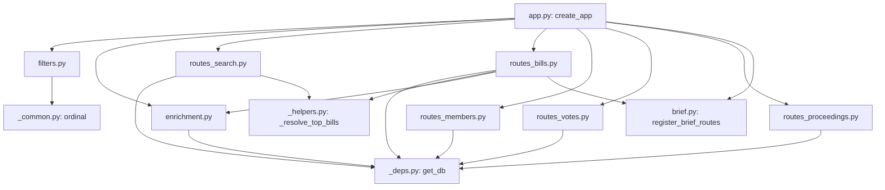

# Decompose `web/app.py` into focused sibling modules

> Split the ~1006-line `src/concord/web/app.py` into focused `web/` sibling modules (filters, enrichment, per-entity route modules, shared deps/helpers) so `app.py` becomes a thin `create_app()` assembly root. Behavior-preserving — no route, response, or signature changes.

## Source

- Code review of [PR #108 — fix(web): render Congress numbers with a correct ordinal suffix (#98)](https://github.com/johnmarcampbell/concord/pull/108), "Change 2" (decompose `web/app.py`). The reviewer explicitly scoped this as a **separate follow-up PR**, not part of #108.
- This plan is the agreed follow-up. It was written with a lightweight grounding pass against the current code rather than a full `grill-with-docs` interview, because the reviewer's spec was already detailed; the two genuine design decisions it surfaced were resolved with the user (see [Approach](#approach)).

## Context

`src/concord/web/app.py` is ~1006 lines, over the 1k "this module is doing too much" smell threshold. It already mixes four concerns in one file: the `create_app()` factory, ~475 lines of route declarations (`_register_routes`), ~220 lines of the ADR-0016 web-initiated-enrichment feature, and the `humanize_age` Jinja filter.

Two markers confirm the smell:
- `_register_routes(app, limiter)` carries `# noqa: C901, PLR0915` ([app.py:229](../../src/concord/web/app.py)) — the author had to silence both "too complex" and "too many statements" to land a single 475-line function.
- The enrichment block (`_register_enrichment_routes` and friends, app.py:765–983) is a self-contained ADR-0016 feature living inline in the factory file.

The `web/` package already has the right pattern to extend: sibling modules expose a `register_*(app, …)` function that `create_app()` calls. `web/brief.py` does exactly this (`register_brief_routes(app)`), and `web/_deps.py` exists specifically to hold shared FastAPI dependencies/constants "so the brief routes can share them without an `app`↔`brief` import cycle" (its own docstring). This plan applies that same pattern to the rest of the routes.

Domain terms (Bill, Member, Vote, Proceeding, Stage 0, enrichment) are in [CONTEXT.md](../../CONTEXT.md). No new terms are introduced.

## Goals

1. `src/concord/web/app.py` shrinks to well under 300 lines: module docstring, the `create_app()` composition root, and the trivial entity-agnostic meta routes (`/healthz`, `/about/methodology`).
2. The `# noqa: C901, PLR0915` waiver on `_register_routes` is **deleted** along with the function — no single remaining function inherits it.
3. Every existing web test passes with **only import-path edits** (no logic, assertion, or fixture changes).
4. `create_app()` remains the single bootstrap entry point (ADR-0012): it still owns `ensure_schema()`, embedder/briefer construction, and all `app.state` setup. The new `register_*` functions only attach routes/filters to an already-configured app.
5. The web→core layering is preserved: every new module is a `web/` sibling; nothing moves into `concord/` core, and FastAPI is not pulled any deeper into the package.

## Non-goals

1. **No behavior changes.** No new/renamed/removed routes, no changed response bodies, status codes, query params, or handler signatures. This is a pure module-move refactor.
2. **No abstraction layer.** Do **not** introduce a `RouteRegistrar` base class, a routing decorator framework, or any shared inheritance to "DRY up" the route modules. They are plain modules with a module-level `register()` function, mirroring `web/brief.py` and consistent with ADR-0007's "stages are modules, not classes" principle.
3. **No test-coverage expansion.** Don't add tests for previously-untested behavior in this PR; the existing suite is the safety net. (A regression line-count check is also out of scope.)
4. **No touching the brief routes.** `web/brief.py` and its `register_brief_routes(app)` already follow the target pattern; leave them as-is.
5. **No `app.py` re-export shims.** Per the resolved decision, importers move to the new modules rather than `app.py` re-exporting moved symbols.

## Relevant prior decisions

- ADR-0012 — Web layer bootstraps an empty schema on startup ([docs/adr/0012-web-bootstraps-empty-schema-on-startup.md](../adr/0012-web-bootstraps-empty-schema-on-startup.md)). `create_app()` must keep calling `ensure_schema(db_path)`; don't reintroduce a "DB missing → exit" check.
- ADR-0016 — Web layer may invoke Stage 0 enrichment on demand ([docs/adr/0016-web-initiated-enrichment.md](../adr/0016-web-initiated-enrichment.md)). The enrichment block moving to `web/enrichment.py` is a pure relocation of this feature; its two gates (`CONGRESS_API_KEY` + `CONCORD_ENABLE_WEB_ENRICHMENT`) and single-worker in-flight set are unchanged.
- ADR-0007 — Parallel Stage 0 + Stage 1 per entity type ([docs/adr/0007-parallel-pipelines-per-entity.md](../adr/0007-parallel-pipelines-per-entity.md)). Cited for its principle, echoed in [CLAUDE.md](../../CLAUDE.md): "Stages are not classes; they're modules… Don't introduce a base class to DRY them up." The per-entity route modules follow the same rule.
- Existing pattern — `web/brief.py:register_brief_routes(app)` and `web/_deps.py` (shared deps to avoid an `app`↔module import cycle). This refactor extends that pattern; **no new ADR is required**. (If the team later wants the "thin assembly root + per-entity route modules" convention recorded, a short ADR could be added, but it is behavior-preserving and follows precedent, so it is not load-bearing for this PR.)

## Relevant files and code

All line numbers are current as of merged PR #108 (master + the ordinal fix).

- `src/concord/web/app.py` — the 1006-line module being decomposed. Key spans:
  - module constants: app.py:59–106 (page sizes, result limits, `_BARE_BILL_RE`, `_ENRICHMENT_FLAG_TRUTHY`, etc.)
  - `_read_enrichment_flag` app.py:109; `_resolve_top_bills` app.py:115
  - `create_app` app.py:130–222 (the keep-it root)
  - `_register_routes` app.py:229–701 (`# noqa: C901, PLR0915`), with nested deps `get_db` (232), `get_embedder` (244) and route handlers: `index` (247), `search_endpoint` (269, `# noqa: C901, PLR0913`), `proceeding` (378), `members_index` (396), `member_profile` (429), `bills_index` (483), `bill_profile` (531), `votes_index` (596), `vote_profile` (640), `about_methodology` (691), `healthz` (697)
  - `_SECTION_OPTIONS` (704), `_is_htmx` (712), `_AGE_BUCKETS` (719), `_JUST_NOW_SECONDS` (729), `humanize_age` (732)
  - enrichment block: `_compute_enrichment_state` (765), `_register_enrichment_routes` (799, `# noqa: C901`) with `request_enrichment` (807) + `enrichment_status` (843), `_bill_row_exists` (893), `_enrich_one_bill` (908, deferred `# noqa: PLC0415` imports), `_record_enrichment_error` (966)
  - `_parse_optional_date` (986); `__all__` (997)
- `src/concord/web/_deps.py` — existing shared-deps module (`VALID_BILL_TYPES`, `db_connection`). Gains the vec-loaded `get_db` dependency.
- `src/concord/web/brief.py` — already follows the target pattern; `bill_profile` imports `assemble_facts`/`cached_view` from here. Unchanged.
- `src/concord/web/search.py`, `web/top_bills.py`, `web/snippets.py` — imported by route modules; unchanged.
- `src/concord/_common.py` — home of `ordinal`; `web/filters.py` imports it to register the filter (the function does **not** move).
- `src/concord/cli/serve.py:53` — imports `create_app` from `concord.web.app`. Must keep working (`create_app` stays in `app.py`).
- Tests that import from `concord.web.app` (the only import-path edits permitted):
  - `tests/test_web_bills.py:30` — `from concord.web.app import create_app, humanize_age`
  - `tests/test_web_bills.py:29` — `from concord.web import app as web_app`, used only for `web_app._enrich_one_bill(...)` at lines 822, 844, 876, 920
  - `tests/test_web_brief.py:13`, `tests/test_smoke.py:24`, `tests/test_web_members.py:18`, `tests/test_web_votes.py:12`, `tests/test_web_routes.py:17` — all `from concord.web.app import create_app` (no change needed; `create_app` stays).

## Approach

The target end-state is the pattern already used by `web/brief.py`: `create_app()` builds the app, sets `app.state`, registers filters, then calls a short list of `register_*()` functions, each living in a focused sibling module.

**Where shared symbols go (the one place the reviewer's spec needed correction).** The reviewer's spec said "small shared helpers stay in `app.py`." But once routes move into `routes_*.py`, any helper those modules import *from `app.py`* creates a cycle, because `app.py` imports the route modules to call their `register()`. Grounding the actual usage counts showed that **almost nothing is genuinely cross-module**:

- `get_db` — used by *every* entity route (10 sites). Genuinely shared → moves to `web/_deps.py` alongside the existing non-vec `db_connection`.
- `_resolve_top_bills` — used by the landing page **and** the bills index (2 modules). Genuinely shared → moves to a new `web/_helpers.py`.
- **Everything else is single-module** and travels *with* its owning route module: `get_embedder`, `_is_htmx`, `_parse_optional_date`, `_SECTION_OPTIONS`, `_BARE_BILL_RE`, `SEARCH_PAGE_SIZE`, `SEARCH_RATE_LIMIT`, `MEMBER_RESULT_LIMIT`, `BILL_RESULT_LIMIT` → `routes_search.py`; `MEMBERS_PAGE_SIZE`, `MEMBER_RECENT_VOTES_LIMIT`, `_PARTY_UNITY_MIN_VOTES` → `routes_members.py`; `BILLS_PAGE_SIZE` → `routes_bills.py`; `VOTES_PAGE_SIZE` → `routes_votes.py`.

This honors the user's decision to **split FastAPI deps (`_deps.py`) from request/data helpers (`_helpers.py`)** while keeping each module's own constants local to it.

**Public surface.** The user chose to **update importers** rather than have `app.py` re-export moved symbols. So `app.py`'s `__all__` shrinks to `["create_app"]`, `humanize_age` is imported from `concord.web.filters`, and the `_enrich_one_bill` test reference points at `concord.web.enrichment`. `create_app` stays in `app.py` (6 test files + `cli/serve.py` import it).

**Meta routes.** `/healthz` and `/about/methodology` are entity-agnostic and trivial. Rather than create a near-empty `routes_meta.py`, they stay in `app.py`, registered by a small local `_register_meta_routes(app)` so `create_app()` itself stays declarative.

**Module dependency graph (no cycles):**

`enrichment.py`, `_deps.py`, `_helpers.py`, and `filters.py` never import the route modules or `app.py`, so the graph is acyclic.

**Ordering.** Smallest-risk first so each commit is independently green and reviewable: filters → enrichment → shared deps/helpers → per-entity route modules (one at a time) → finally delete the gutted `_register_routes` and shrink `app.py`. The `register()` for routes_search takes `(app, limiter)` (search is the only rate-limited route); the other four take `(app)`.

## Step-by-step plan

Run `uv run ruff check && uv run ruff format --check && uv run mypy src && uv run pytest` after each step; every step must leave the suite green.

1. **Extract `web/filters.py`.** Create `src/concord/web/filters.py`. Move `humanize_age` (app.py:732–760), `_AGE_BUCKETS` (719–724), and `_JUST_NOW_SECONDS` (727) into it. Add `register_filters(templates: Jinja2Templates) -> None` that does `templates.env.filters["humanize_age"] = humanize_age` and `templates.env.filters["ordinal"] = ordinal` (importing `ordinal` from `concord._common`). In `app.py`, replace the two `templates.env.filters[...] = …` lines (app.py:211–212) with `register_filters(templates)` and drop the now-unused `humanize_age`/`ordinal` imports and the `_AGE_BUCKETS`/`_JUST_NOW_SECONDS` constants. Remove `humanize_age` from `__all__`.

2. **Repoint the `humanize_age` test import.** In `tests/test_web_bills.py:30`, change `from concord.web.app import create_app, humanize_age` to `from concord.web.app import create_app` + `from concord.web.filters import humanize_age`. Verify `tests/test_web_bills.py::TestHumanizeAge` passes.

3. **Extract `web/enrichment.py`.** Create `src/concord/web/enrichment.py`. Move the whole enrichment feature: `_ENRICHMENT_FLAG_TRUTHY` (app.py:106), `_read_enrichment_flag` (109), `_compute_enrichment_state` (765), `_register_enrichment_routes` (799) — **rename to public `register_enrichment_routes`** to match `register_brief_routes` — its nested `request_enrichment`/`enrichment_status`, `_bill_row_exists` (893), `_enrich_one_bill` (908, keep its `# noqa: PLC0415` deferred imports), and `_record_enrichment_error` (966). Move the `BILL_ENRICHMENT_SECTIONS` import and `_db_for_status`/`db_connection` usage into this module. Keep the module's `_log = logging.getLogger("concord.web")`. In `app.py`: import `_read_enrichment_flag` and `register_enrichment_routes` from `concord.web.enrichment`, and update the call site (app.py:220) to `register_enrichment_routes(app)`. Keep `_register_enrichment_routes`'s `# noqa: C901` on the moved function (it is inherent to the two-route declaration).

4. **Repoint the `_enrich_one_bill` test reference.** In `tests/test_web_bills.py`, change line 29 `from concord.web import app as web_app` to `from concord.web import enrichment as web_enrichment`, and update the four call sites (822, 844, 876, 920) from `web_app._enrich_one_bill(...)` to `web_enrichment._enrich_one_bill(...)`. (This is mechanical reference-tracking forced by the module move, not a behavioral edit; the calls and assertions are otherwise unchanged.) Verify the enrichment tests pass.

5. **Move `get_db` to `web/_deps.py`.** Lift the nested `get_db` closure (app.py:232–240) to a module-level function in `src/concord/web/_deps.py`, alongside the existing `db_connection`. Add the `sqlite_vec` import there. It keeps the same body (per-request `sqlite3.connect` + `sqlite_vec.load`). Leave `get_db` referenced from `_register_routes` via an import for now (intermediate state) so the suite stays green; it will be imported by the route modules in the next steps.

6. **Create `web/_helpers.py` with `_resolve_top_bills`.** Move `_resolve_top_bills` (app.py:115–127) into a new `src/concord/web/_helpers.py`, importing `CURATED_TOP_BILLS` from `concord.web.top_bills` and `search` as `search_mod` from `concord.web`. Update the (still-inline) `index` and `bills_index` handlers to import it from `concord.web._helpers`.

7. **Extract `web/routes_search.py`.** Create the module with `register(app: FastAPI, limiter: Limiter) -> None` that declares the `/` (landing) and `/search` routes (app.py:247–373). Move into this module the search-only symbols: `get_embedder` (244), `_is_htmx` (712), `_parse_optional_date` (986), `_SECTION_OPTIONS` (704), `_BARE_BILL_RE` (93), `SEARCH_PAGE_SIZE` (62), `SEARCH_RATE_LIMIT` (59), `MEMBER_RESULT_LIMIT` (84), `BILL_RESULT_LIMIT` (87). Keep `search_endpoint`'s `# noqa: C901, PLR0913`. Import `get_db` from `_deps`, `_resolve_top_bills` from `_helpers`, snippets from `concord.web.snippets`. Remove these handlers/symbols from `_register_routes`; have `create_app()` call `routes_search.register(app, limiter)`.

8. **Extract `web/routes_proceedings.py`.** `register(app)` declaring `/proceedings/{granule_id}` (app.py:377–391). Imports `get_db` from `_deps`. Remove from `_register_routes`; wire into `create_app()`.

9. **Extract `web/routes_members.py`.** `register(app)` declaring `/members` and `/members/{bioguide_id}` (app.py:395–478). Move `MEMBERS_PAGE_SIZE` (65), `MEMBER_RECENT_VOTES_LIMIT` (74), `_PARTY_UNITY_MIN_VOTES` (79). Import `get_db` from `_deps`. Remove from `_register_routes`; wire into `create_app()`.

10. **Extract `web/routes_votes.py`.** `register(app)` declaring `/votes` and `/votes/{chamber}/{congress}/{session}/{roll_number}` (app.py:595–686). Move `VOTES_PAGE_SIZE` (71). Import `get_db` from `_deps`. Remove from `_register_routes`; wire into `create_app()`.

11. **Extract `web/routes_bills.py`.** `register(app)` declaring `/bills` and `/bills/{congress}/{bill_type}/{bill_number}` (app.py:482–591). Move `BILLS_PAGE_SIZE` (68). Import `get_db` from `_deps`, `_resolve_top_bills` from `_helpers`, `_compute_enrichment_state` from `concord.web.enrichment`, `assemble_facts`/`cached_view` from `concord.web.brief`, `VALID_BILL_TYPES` from `_deps`. Remove from `_register_routes`; wire into `create_app()`.

12. **Delete `_register_routes` and add `_register_meta_routes`.** `_register_routes` should now be empty except for `/healthz` and `/about/methodology`. Replace it with a small `_register_meta_routes(app)` holding just those two routes, and **delete the `# noqa: C901, PLR0915` waiver** (Goal 2). Update `create_app()` to call `_register_meta_routes(app)`.

13. **Shrink `app.py` and prune imports.** `create_app()` body should read: `ensure_schema` → embedder/briefer construction → `app.state.*` → `limiter` → `templates = Jinja2Templates(...)` + `register_filters(templates)` → static mount → `_register_meta_routes(app)`, `routes_search.register(app, limiter)`, `routes_bills.register(app)`, `routes_members.register(app)`, `routes_votes.register(app)`, `routes_proceedings.register(app)`, then the gated `register_enrichment_routes(app)` and `register_brief_routes(app)`. Remove every now-unused import and constant from `app.py`. Set `__all__ = ["create_app"]`. Confirm `wc -l src/concord/web/app.py` is under 300.

14. **Full green sweep.** Run `uv run ruff check && uv run ruff format --check && uv run mypy src && uv run pytest`. Confirm: no `C901`/`PLR0915` waiver remains on any `_register_*` wrapper (only `search_endpoint`'s own `C901, PLR0913` and the moved `register_enrichment_routes`'s `C901` survive, both inherent to those handlers); all web tests pass with only the import edits from steps 2 and 4.

## Demo seed data

N/A — pure refactor. No new tables, columns, entity types, routes, or API capabilities; nothing to seed.

## Testing strategy

- **No new tests.** The refactor is behavior-preserving; the existing web suite is the safety net.
- **Regression suite that must stay green:** `tests/test_web_routes.py` (route rendering, 404s, htmx fragments), `tests/test_web_bills.py` (bill profile + enrichment, incl. direct `_enrich_one_bill` calls + `TestHumanizeAge`), `tests/test_web_members.py`, `tests/test_web_votes.py`, `tests/test_web_brief.py`, `tests/test_smoke.py`.
- **Permitted test edits, total:** `tests/test_web_bills.py` only — the `humanize_age` import (step 2) and the `_enrich_one_bill` reference (step 4). No other test file should change. If any other test needs editing, that's a signal the refactor changed behavior — stop and reconsider.
- **Static checks:** `uv run mypy src` (strict on `src/concord/`) must stay clean through every step; `uv run ruff check` must pass, and the `_register_routes` `C901, PLR0915` waiver must be gone by step 12.
- **Manual smoke (optional):** `uv run concord serve` and load `/`, a bill profile, a member profile, a vote profile, a proceeding, and `/healthz` to confirm pages render.

## Acceptance criteria

- [ ] `src/concord/web/app.py` is under 300 lines and contains only: docstring, imports, `create_app()`, `_register_meta_routes()`, and `__all__ = ["create_app"]`.
- [ ] New modules exist: `web/filters.py`, `web/enrichment.py`, `web/_helpers.py`, `web/routes_search.py`, `web/routes_bills.py`, `web/routes_members.py`, `web/routes_votes.py`, `web/routes_proceedings.py`; `web/_deps.py` has gained `get_db`.
- [ ] No `# noqa: C901` or `# noqa: PLR0915` remains on any `_register_*`/route-registration wrapper. (`search_endpoint` and `register_enrichment_routes` keep their own inherent waivers.)
- [ ] `create_app` is still importable from `concord.web.app` (verified by `cli/serve.py` and the 6 test files).
- [ ] Only `tests/test_web_bills.py` was edited, and only its import lines / module references (steps 2 + 4).
- [ ] No `web/` module imports `concord.web.app`, and no core (`concord/…`) module imports anything under `concord.web` (layering preserved).
- [ ] All existing tests pass (`uv run pytest`).
- [ ] Lint, format, and types clean (`uv run ruff check && uv run ruff format --check && uv run mypy src`).
- [ ] Landed as its own PR, referencing #108 for context.

## Open questions

None — design decisions were resolved:
- Shared-symbol placement: split `_deps.py` (FastAPI deps + `get_db`) from a new `_helpers.py` (`_resolve_top_bills`); single-module symbols stay with their route module. *(resolved)*
- Public surface: update importers; no `app.py` re-export shims; `__all__` shrinks to `["create_app"]`. *(resolved)*
- `/healthz` + `/about/methodology` home: stay in `app.py` via `_register_meta_routes` rather than a near-empty `routes_meta.py`. *(resolved — low-stakes; an executor who prefers a `routes_meta.py` may make that call, but it is not required.)*

## Out-of-band work

- This is the agreed follow-up to PR #108 (the `ordinal` fix); land it only after #108 merges, since both touch `app.py` (the filter registration moves into `web/filters.py` in step 1).
- A separate, already-planned follow-up exists for enrichment rate-limiting ([docs/plans/enrichment-rate-limiting.md](enrichment-rate-limiting.md)); it will touch the enrichment routes. Whichever lands second rebases onto the other — no conflict in scope, but note the shared file (`web/enrichment.py` after this refactor).
