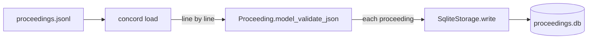

# Stage 1 — Load (JSONL → SQLite `proceedings` table)

> Build the first half of the derived-store pipeline: a SQLite backend that mirrors the canonical JSONL into a queryable `proceedings` table, and a `concord load` CLI to run it. No chunks, no FTS5, no embeddings — those are Stage 2.

## Source

- Architecture decisions resolved during a `grill-with-docs` session on 2026-05-24. The relevant outputs from that session are:
  - [CONTEXT.md](../../CONTEXT.md) — domain glossary, including "Stage 1 — Load"
  - [ADR-0002 — JSONL as the canonical raw store](../adr/0002-jsonl-as-canonical-raw-store.md)
  - [ADR-0003 — SQLite as the derived store](../adr/0003-sqlite-as-derived-store.md)
- No GitHub issue exists for this work yet. File one before starting if you want PR/branch tracking, otherwise treat this plan as the work item.

## Context

Concord's scraper writes the canonical raw store as `proceedings.jsonl` (one [Proceeding](../../CONTEXT.md) per line, append-only). That file is the source of truth, but it's not directly queryable — you can't filter by date or look up a single granule without scanning. The pipeline therefore derives a SQLite database from it. The derived store is regenerable: blow it away, re-run, get the same result.

This plan covers the first stage of that derivation. Stage 1's only job is to take JSONL and produce a SQLite mirror — metadata and full text in one table. It builds none of the search machinery (chunks, FTS5, vector embeddings); that's Stage 2's job, and it will read from the `proceedings` table this stage produces.

The work fits cleanly into the existing storage abstraction. [`src/concord/storage/base.py`](../../src/concord/storage/base.py) defines a `Storage` Protocol with two methods (`has(granule_id) -> bool`, `write(proceeding) -> None`); [`src/concord/storage/jsonl.py`](../../src/concord/storage/jsonl.py) and [`src/concord/storage/mongo.py`](../../src/concord/storage/mongo.py) are the existing implementations. Stage 1 adds a third: `SqliteStorage`.

## Goals

1. New `SqliteStorage` class implementing the existing `Storage` Protocol, persisting to a single SQLite file with a `proceedings` table whose columns mirror the `Proceeding` Pydantic model.
2. New CLI command `concord load --jsonl PATH --db PATH [--limit N]` that streams a JSONL file into the SQLite store.
3. Idempotency: re-running `concord load` against an unchanged JSONL produces zero new rows. Re-running after the JSONL has grown loads only the new records.
4. Tests covering schema creation, idempotent writes, round-trip integrity (Proceeding → SQLite row → Proceeding), bulk loads, and the CLI's flag parsing and summary output.

## Non-goals

1. **Chunks table.** Stage 2 work. The `proceedings` table is the only schema this plan adds.
2. **FTS5 virtual table.** Stage 2 work.
3. **`sqlite-vec` extension or vector embeddings.** Stage 2 work.
4. **Formal schema migrations** (Alembic, yoyo, etc.). The "rebuild from JSONL" recovery story makes formal migrations unnecessary; schema changes are handled by deleting the SQLite file and re-running `concord load`. Document this in the CLI help text but don't build tooling.
5. **Removing or deprecating `JsonlStorage`.** It's still the scraper's write target (per ADR-0002, JSONL is canonical). `SqliteStorage` is downstream of `JsonlStorage`, not a replacement.
6. **Removing or deprecating `MongoStorage`.** ADR-0003 demotes it from "recommended" but it stays in the codebase as an alternative backend.
7. **Wiring `SqliteStorage` into the scraper as a direct write target.** The scraper writes JSONL; `concord load` is the only path that writes SQLite. Bypassing JSONL would violate ADR-0002.
8. **Web layer / search endpoints / any HTTP serving.** Separate plan.

## Relevant prior decisions

- **ADR-0001 — Python end-to-end for the web layer** ([docs/adr/0001-python-end-to-end-for-the-web-layer.md](../adr/0001-python-end-to-end-for-the-web-layer.md)). Relevant only insofar as it confirms the stack stays Python; no language choice to make here.
- **ADR-0002 — JSONL as the canonical raw store** ([docs/adr/0002-jsonl-as-canonical-raw-store.md](../adr/0002-jsonl-as-canonical-raw-store.md)). Establishes that JSONL is the source of truth and SQLite is derived. Means `SqliteStorage` is *only* written to from a JSONL reader, never directly from the scraper.
- **ADR-0003 — SQLite as the derived store** ([docs/adr/0003-sqlite-as-derived-store.md](../adr/0003-sqlite-as-derived-store.md)). Establishes SQLite as the recommended backend and explains the consequence: hybrid search later joins FTS5 and `sqlite-vec` in one SQL query. The schema this plan creates needs to be a clean foundation for that.
- **The existing `Storage` Protocol** in [src/concord/storage/base.py](../../src/concord/storage/base.py). Reuse it; do not invent a new abstraction for SQLite.

## Relevant files and code

Files this plan reads or modifies. All paths verified.

- `src/concord/models.py` — defines `Proceeding`. Its fields are the column list for the new table. Pay attention to types: `issue_date` is `date`, `update_date` and `fetched_at` are `datetime`, `session` is `Literal[1, 2]`, `text_url` and `pdf_url` are `HttpUrl`. SQLite has no native date/datetime/URL types, so these serialize to TEXT (use `Proceeding.model_dump(mode="json")` for clean string representations, the same approach `MongoStorage.write` uses today).
- `src/concord/storage/base.py` — the `Storage` Protocol. `SqliteStorage` must conform.
- `src/concord/storage/jsonl.py` — reference implementation. Particularly: how `__init__(path)` does lazy parent-directory creation, how `has()` and `write()` interact with an in-memory dedup set, the `__len__` and `path` introspection methods. `SqliteStorage` does not need the in-memory set (SQL handles dedup), but should match the same surface.
- `src/concord/storage/mongo.py` — reference for serialization via `proceeding.model_dump(mode="json")` and for the "catch the duplicate-key error as a no-op" pattern. `SqliteStorage` uses `INSERT OR IGNORE` instead, which doesn't raise on duplicates, but the modeling approach is the same.
- `src/concord/storage/__init__.py` — re-exports backends. Add `SqliteStorage` to `__all__`.
- `src/concord/cli.py` — `typer.Typer` app. Add a new `@app.command("load")` here, following the structure of the existing `pull_command`.
- `tests/test_storage_jsonl.py` — pattern for storage tests: per-class grouping (`TestProtocol`, `TestWriteAndHas`, `TestDedup`, `TestRoundTrip`, etc.) with a `_sample_proceeding` helper that builds a `Proceeding` whose granule_id matches its URLs.
- `tests/test_storage_mongo.py` — also a pattern, especially `TestIndex` (verifying schema constraints) and `TestErrorPropagation`.
- `tests/test_cli.py` — pattern for CLI tests using `typer.testing.CliRunner`, plus the `_strip` helper for ANSI sequences. The `stub_pull` fixture pattern is a good template for stubbing the load function in CLI tests.
- `pyproject.toml` — no changes needed. `sqlite3` is stdlib; no new dependency.

## Approach

`SqliteStorage` wraps a single `sqlite3.Connection` to a database file. On construction it ensures the schema exists (`CREATE TABLE IF NOT EXISTS proceedings (...)` plus a couple of secondary indexes), enables WAL mode (`PRAGMA journal_mode=WAL`) so the future web server can read concurrently while the loader writes, and stores the connection on the instance for reuse.

Dedup uses `INSERT OR IGNORE INTO proceedings (...) VALUES (...)` rather than the in-memory `set` approach `JsonlStorage` uses. Two reasons: (1) SQLite's unique constraint on the `granule_id` primary key already enforces dedup, so an in-memory mirror is redundant; (2) for the eventual 30-year corpus (~290k rows), loading every granule_id into a Python set on startup is wasteful when one SQL statement does it for free. The trade-off is that `write()` issues one SQL statement per Proceeding instead of doing the dedup check in-process; SQLite is fast enough at this that the difference doesn't matter, and we can batch later if needed.

The `proceedings` schema mirrors the `Proceeding` model 1:1. Columns are typed `TEXT` for strings/dates/URLs and `INTEGER` for integers. SQLite's loose type affinity means we don't need to invent date/datetime types — ISO 8601 strings round-trip fine via `Proceeding.model_validate({...})` since Pydantic already coerces ISO strings to `date`/`datetime`. Two secondary indexes (`issue_date`, `congress`) cover the obvious metadata-filter queries the eventual web search will issue; the FTS5 and `sqlite-vec` indexes added in Stage 2 will be virtual tables, not part of this DDL.

`concord load` is a thin CLI:

It opens the JSONL, iterates line-by-line (no full-file load — the file can be multi-GB), validates each line into a `Proceeding`, and writes through `SqliteStorage`. On completion it prints `Loaded N new proceedings into PATH (skipped M already present)`. The "skipped" count comes from a small `LoadResult` returned by a helper module rather than baked into `SqliteStorage` itself — `SqliteStorage.write()` stays no-arg-returning to match the Protocol; the loader tracks `(written, skipped)` outside it by calling `has()` before each `write()`. (This mirrors how the existing pipeline tracks the same counts.)

Malformed JSONL lines (truncated writes, bad JSON, missing fields) follow the same recovery pattern as `JsonlStorage._load_seen_granule_ids`: skipped with a single warning log, not fatal. Losing one record from a long load is better than killing the whole run.

## Step-by-step plan

1. **Add `src/concord/storage/sqlite.py` with the `SqliteStorage` class.** Constructor `__init__(self, path: Path | str)` opens a `sqlite3.Connection`, enables WAL via `PRAGMA journal_mode=WAL`, sets `PRAGMA foreign_keys=ON` (defensive, not used yet), and runs the schema DDL inside a single `CREATE TABLE IF NOT EXISTS proceedings (...)` plus `CREATE INDEX IF NOT EXISTS idx_proceedings_issue_date ON proceedings(issue_date)` and `... idx_proceedings_congress ON proceedings(congress)`. Implement `has(granule_id) -> bool` as `SELECT 1 FROM proceedings WHERE granule_id = ? LIMIT 1`. Implement `write(proceeding) -> None` as `INSERT OR IGNORE INTO proceedings (...) VALUES (...)`, serializing via `proceeding.model_dump(mode="json")` and pulling the values in column order. Add `__len__(self) -> int` as `SELECT COUNT(*) FROM proceedings` and `path` property returning the stored `Path`. Add `close(self) -> None` and `__enter__`/`__exit__` so the connection can be context-managed.

2. **Re-export `SqliteStorage`.** Edit `src/concord/storage/__init__.py` to add `from .sqlite import SqliteStorage` and include `SqliteStorage` in `__all__` (currently lists `JsonlStorage`, `MongoStorage`, `Storage`).

3. **Add `concord load` to `src/concord/cli.py`.** New `@app.command("load")` function `load_command` with three flags:
   - `--jsonl PATH` (required, no default) — input JSONL file
   - `--db PATH` (default `./proceedings.db`) — output SQLite file
   - `--limit N` (optional) — cap on records loaded, useful for smoke tests

   Body: open the JSONL with a context manager, iterate lines, skip blanks, `Proceeding.model_validate_json(line)` inside a try/except that logs a warning and continues on `ValidationError` or `json.JSONDecodeError`. For each valid Proceeding: check `storage.has(p.granule_id)`, if False call `storage.write(p)` and increment `written`, else increment `skipped`. Break when `limit` is reached. Print `Loaded {written} new proceedings into {db} (skipped {skipped} already present)`.

4. **Add `tests/test_storage_sqlite.py`.** Mirror the structure of `tests/test_storage_jsonl.py`. Tests to include:
   - `TestProtocol.test_sqlite_storage_satisfies_storage_protocol` — annotate as `Storage`, assert `hasattr` for `has` and `write`.
   - `TestSchema.test_proceedings_table_exists` — query `sqlite_master`, assert table presence.
   - `TestSchema.test_indexes_exist` — query `sqlite_master`, assert `idx_proceedings_issue_date` and `idx_proceedings_congress`.
   - `TestSchema.test_wal_mode_enabled` — `SELECT * FROM pragma_journal_mode()` returns `wal`.
   - `TestWriteAndHas.test_has_returns_false_for_unseen`, `test_has_returns_true_after_write`, `test_multiple_writes_each_persist`, `test_len_tracks_written_count`.
   - `TestDedup.test_writing_same_granule_twice_is_noop` — second write doesn't raise and doesn't add a row.
   - `TestDedup.test_dedup_persists_across_instances` — close, reopen, `has()` returns True.
   - `TestRoundTrip.test_written_row_can_be_parsed_back_as_proceeding` — read the row via raw SQL, reconstruct via `Proceeding.model_validate`, assert equality with the original.
   - `TestPath.test_accepts_string_path`, `TestPath.test_creates_parent_directories`.

   Reuse the `_sample_proceeding` helper pattern from `test_storage_jsonl.py:14` (the one whose URLs are derived from the granule_id so the Article model's cross-check passes).

5. **Add `concord load` CLI tests to `tests/test_cli.py`.** Following the patterns already in the file:
   - `TestLoadCommand.test_help_lists_all_flags` — `--jsonl`, `--db`, `--limit` all appear in `--help` (use `_strip` for ANSI).
   - `TestLoadCommand.test_loads_jsonl_into_sqlite` — write a small JSONL to `tmp_path`, invoke `concord load`, assert exit 0 and the success message shape, then open the resulting SQLite and verify row count.
   - `TestLoadCommand.test_idempotent_when_jsonl_unchanged` — load twice in a row, assert the second run reports `0 new, N already present`.
   - `TestLoadCommand.test_limit_caps_writes` — JSONL with 5 records, `--limit 2`, assert only 2 rows landed.
   - `TestLoadCommand.test_malformed_line_skipped` — JSONL with a truncated line in the middle, assert good records still load.
   - `TestLoadCommand.test_missing_jsonl_file_exits_cleanly` — invoke with a path that doesn't exist, assert exit code != 0 and the error message names the missing file (no traceback).

6. **Run the full local CI suite and fix anything that breaks.** `uv sync && uv run ruff check && uv run ruff format --check && uv run mypy src && uv run pytest`. Existing 110 tests must still pass; new tests should bring the total to ~125–130.

7. **Smoke-test against a real JSONL.** With `CONGRESS_API_KEY` set, run `uv run concord pull --from 2026-05-22 --to 2026-05-22 --storage /tmp/concord_demo.jsonl --limit 5` to produce a small JSONL, then `uv run concord load --jsonl /tmp/concord_demo.jsonl --db /tmp/concord_demo.db`. Open the resulting DB with `sqlite3 /tmp/concord_demo.db "SELECT granule_id, issue_date, title FROM proceedings"` and confirm rows are present. Re-run the load — should report `0 new, 5 already present`.

## Demo seed data

Not applicable. Concord doesn't have a demo-mode pattern or a `seed.sql` file (the project doesn't follow that template). The closest equivalent is the JSONL fixture file the executor would produce in step 7; it's transient, not committed.

## Testing strategy

**Unit tests** in `tests/test_storage_sqlite.py` (new file): protocol conformance, schema (table + indexes + WAL), idempotency, dedup across instances, round-trip via `Proceeding.model_validate`, path handling. ~10 tests, modeled on `tests/test_storage_jsonl.py`.

**CLI tests** in `tests/test_cli.py` (extending existing file): `--help` flag listing, end-to-end load from a tmp JSONL, idempotency, `--limit`, malformed-line tolerance, missing-file error path. ~6 new tests.

**Manual smoke test**: step 7 of the plan exercises the real CLI against a real (small) JSONL.

**Regression risk**: low. New module, new CLI command. The only file the plan modifies beyond additions is `src/concord/cli.py` (add a new command) and `src/concord/storage/__init__.py` (add an export). Existing tests must continue to pass — particularly `tests/test_storage_jsonl.py`, `tests/test_storage_mongo.py`, and the existing CLI tests for `concord pull`.

## Acceptance criteria

- [ ] `src/concord/storage/sqlite.py` exists, implements the `Storage` Protocol, and has docstrings comparable to `jsonl.py` and `mongo.py`.
- [ ] `SqliteStorage` enables WAL mode on construction (verified by a test).
- [ ] The `proceedings` table has one column per `Proceeding` field, with `granule_id` as primary key.
- [ ] Secondary indexes on `issue_date` and `congress` exist.
- [ ] `concord load --help` shows `--jsonl`, `--db`, `--limit`.
- [ ] `concord load` is registered in `pyproject.toml`'s entry point (via the existing `concord = "concord.cli:main"` script — should require no pyproject change since it's a new subcommand on the same app).
- [ ] Loading the same JSONL twice produces zero duplicate rows.
- [ ] Malformed JSONL lines are logged and skipped, not fatal.
- [ ] `uv run ruff check` passes.
- [ ] `uv run ruff format --check` passes.
- [ ] `uv run mypy src` passes (strict mode).
- [ ] `uv run pytest` passes — all 110 existing tests plus ~16 new ones, around 126 total.
- [ ] CI is green on the PR.
- [ ] The smoke test in step 7 succeeds.

## Open questions

- **Q: Should `SqliteStorage` keep a single long-lived `sqlite3.Connection`, or open a new connection per call?** The plan recommends a single long-lived connection on the instance, matching the lifetime model of `JsonlStorage` (which keeps its file path on the instance and opens connections on demand for writes). For the Stage 1 loader this is unambiguously right — one writer, no threading. The Web layer (separate, future) will want its own connection-per-request strategy; that's not this plan's concern. **Default: single connection on the instance, document the "not thread-safe" caveat in the docstring.** Executor can pick differently if they have a strong reason; no need to escalate.

- **Q: Should the schema include `CHECK` constraints for `session IN (1, 2)`?** The `Proceeding` model already enforces this via `Literal[1, 2]`, so any value reaching SQLite is already validated. A `CHECK` constraint would be belt-and-suspenders. **Default: no `CHECK` constraint. Trust the model.** Add later if a non-Pydantic writer ever appears.

- **Q: Should the loader emit progress output for long loads?** The existing pipeline `pull` has a `--progress` flag (see `cli.py:pull_command`); replicating it for `load` would be consistent. Not in the plan as a goal because Stage 1 loads are fast (minutes for a 5-year corpus, since there's no network), but the executor may add it if they want symmetry. **Default: no `--progress` flag for `load` in this plan; revisit if real-world loads feel slow.**

## Out-of-band work

- **Stage 2 (Index)** will follow this plan and is the natural next deliverable. It extends the same `proceedings.db` file with a `chunks` table, an FTS5 virtual table over chunks, and a `sqlite-vec` virtual table. The Stage 1 schema must not preclude that; in particular, `granule_id` as primary key of `proceedings` lets `chunks` carry it as a foreign key in Stage 2.
- **Web layer** consumes the SQLite file Stage 1 produces but is out of scope here. The Web layer's connection model (per-request connections, WAL-friendly) is enabled by this plan's choice to turn on WAL but otherwise unaffected.
