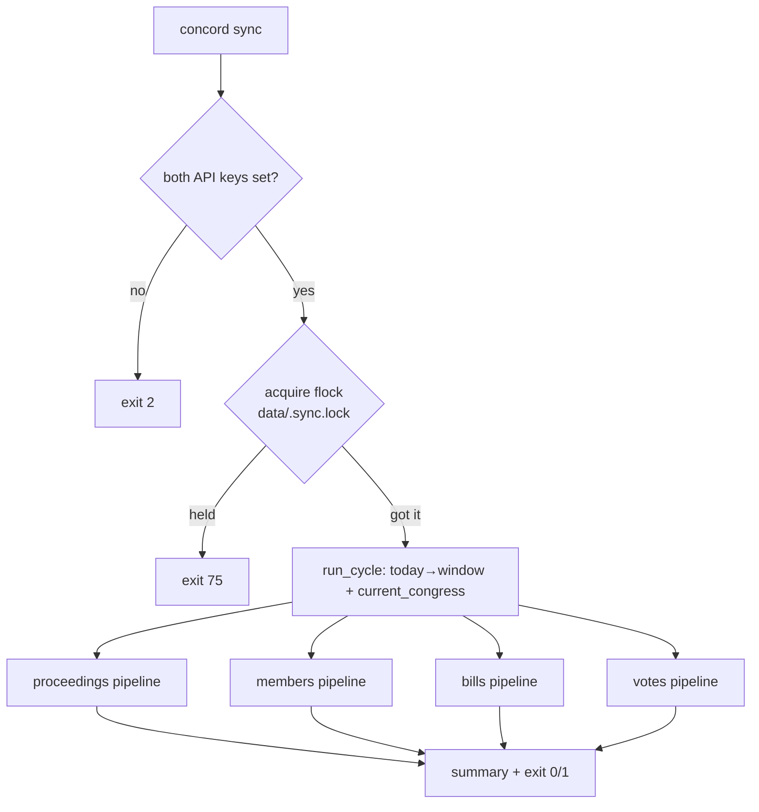

# `concord sync` — scheduled all-entity incremental scraping

> Add a single `concord sync` command that performs one bounded, best-effort incremental pass over all four entity types (proceedings, members, bills, votes), so an operator's cron/systemd timer can keep the demo current with one tested command instead of drifting shell snippets.

## Source

- **ADR 0026 — Scheduled scraping is a `sync` command, not a resident daemon** ([docs/adr/0026-sync-command-not-resident-daemon.md](../adr/0026-sync-command-not-resident-daemon.md)). The full design and the rejected alternatives live here; this plan is the execution of that ADR.
- **CONTEXT.md → Orchestration** ([../../CONTEXT.md](../../CONTEXT.md)) defines the load-bearing terms: **Sync**, **Backfill**, **Current Congress**.
- Design settled in a grilling session (grill-with-docs); no other durable source.

## Context

Concord scrapes four entity types through three stages each (Scrape → Load → Index; see CONTEXT.md → Pipeline stages). Today each entity has its own `concord run <entity>` command that chains its own stages. There is **no** cross-entity, schedule-friendly entry point, so the documented way to keep a deployment current is a hand-written cron block in [docs/deployment.md](../deployment.md) — which has rotted: it still calls `concord pull`, a command renamed to `concord scrape proceedings` long ago. Because that orchestration lives as untested Markdown, nothing caught the drift.

A **Sync** (CONTEXT.md → Orchestration) is one bounded incremental pass across all four entities, full pipeline each, run on a schedule the operator owns. It is *not* a resident daemon (ADR 0026 rejects the loop) and *not* a **Backfill** (historical pulls stay one-shot `run <entity>` calls). This plan adds the `concord sync` command and the small amount of shared code it needs, moving the orchestration into tested Python so it can no longer drift silently.

## Goals

1. `concord sync` exists as a root-level command (alongside `concord serve`) and runs one Sync: Scrape → Load → Index for proceedings, members, bills, and votes.
2. Proceedings are scraped over a rolling window `[today − lookback, today]` (`--lookback-days`, default 7). Members, bills, and votes are scraped over the **current Congress** only, with `skip_unchanged=True`.
3. A reusable `current_congress(today)` helper exists and is unit-tested at the Jan-3 Congress boundaries.
4. Each entity's stage-chaining is extracted into a `run_<entity>_pipeline(...)` function that both `run <entity>` and `sync` call — one definition, no duplication. The `run <entity>` commands behave exactly as before.
5. Sync is **best-effort across entities**: one entity failing is captured and reported but does not abort the others.
6. Sync **self-guards against overlap** via an advisory `fcntl.flock` on `data/.sync.lock`; a second concurrent invocation bows out cleanly.
7. Exit-code contract is explicit and tested: `0` all ok · `1` ≥1 entity failed · `2` missing API key · `75` another Sync already running.
8. `docs/deployment.md` and `docs/docker.md` drive `concord sync` and no longer reference the nonexistent `concord pull` / `concord pull-members`.

## Non-goals

1. **No resident daemon / loop.** No `threading.Event`, no `heartbeat.json`, no signal handlers, no file logging — ADR 0026 rejects all of these; cadence is the scheduler's job.
2. **No persisted "Sync Run" table.** Per-entity **Scrape Runs** (ADR 0021) plus the command's exit code and stderr summary are the record. No new SQLite schema.
3. **No entity selector** (`--only` / `--skip`). Sync is monolithic — always all four.
4. **No backfill behavior.** Sync never widens to historical date ranges or closed Congresses; that stays `run <entity>`.
5. **No `Settings` layer / config file / dotenv autoload.** Configuration is CLI flags + the two existing env keys, per project convention (CLAUDE.md).
6. **No changes to the per-entity scrapers, loaders, or indexers.** Only the CLI orchestration layer changes.
7. **No bulk bills enrichment.** Sync scrapes basic Bill identity/detail only; cosponsors/actions/subjects/titles/summaries stay on-demand per [ADR 0016](../adr/0016-web-initiated-enrichment.md). Bulk-enriching a whole Congress is a Backfill-shaped follow-up (see Out-of-band).

## Relevant prior decisions

- **ADR 0026 — Sync command, not resident daemon** (new, created with this plan) ([docs/adr/0026-sync-command-not-resident-daemon.md](../adr/0026-sync-command-not-resident-daemon.md)).
- **ADR 0007 — Parallel pipelines per entity** ([docs/adr/0007-parallel-pipelines-per-entity.md](../adr/0007-parallel-pipelines-per-entity.md)): stages are modules, not classes; **no base class** to DRY entities; cross-entity orchestration belongs at the CLI level. The cycle calls the four pipelines *explicitly* — do not introduce a shared protocol/ABC.
- **ADR 0015 — Staleness-aware re-scrape** ([docs/adr/0015-staleness-aware-rescrape.md](../adr/0015-staleness-aware-rescrape.md)): "daily incremental is just `--skip-unchanged`." Sync sets `skip_unchanged=True` for the mutable entities.
- **ADR 0021 — Scrape Run observability** ([docs/adr/0021-scrape-run-observability.md](../adr/0021-scrape-run-observability.md)): each entity scrape mints a Scrape Run; a Sync produces up to four. Stage 1/2 failures produce *no* Scrape Run, which is why the summary + exit code are load-bearing.
- **ADR 0022 — Internal import convention** ([docs/adr/0022-internal-import-convention.md](../adr/0022-internal-import-convention.md)): import from the defining submodule, absolute imports only. `cli/__init__.py` is the Typer composition root.
- **ADR 0014 — PyPI, CLI-first** ([docs/adr/0014-publish-to-pypi-cli-first.md](../adr/0014-publish-to-pypi-cli-first.md)): the CLI shape is the stable contract; `concord sync` becomes part of it.

## Relevant files and code

- `src/concord/cli/__init__.py` — Typer composition root; registers `serve` via `app.command("serve")(serve_command)` (line 71). `sync` registers the same way.
- `src/concord/cli/_apps.py` — the four stage sub-apps. `sync` is **not** a stage command; it registers on the root `app`, like `serve`.
- `src/concord/cli/_common.py` — shared helpers: `DEFAULT_DB` (`./data/proceedings.db`, line 23), `ENV_OPENAI_API_KEY` (line 17), `_require_openai_key` (line 186), `Progress`, `RateTracker`, `_parse_congresses`.
- `src/concord/api.py` — `ENV_API_KEY` (`"CONGRESS_API_KEY"`), imported by the entity modules.
- `src/concord/cli/proceedings.py` — `run_proceedings_command` (line 372) chains `_run_scrape_proceedings` (44) → `_run_load` (93) → `_run_index` (149). `DEFAULT_JSONL = ./data/proceedings.jsonl` (line 36). Gates `ENV_API_KEY` **and** OpenAI key.
- `src/concord/cli/members.py` — `run_members_command` (line 223) chains `_run_scrape_members` (30) → `_run_load_members` (86) → `_run_index_members` (110). `DEFAULT_MEMBERS_JSONL` (18), `DEFAULT_MEMBER_CONGRESSES = (117, 118, 119)` (22). Stage 2 is FTS-only (no OpenAI). `_run_scrape_members` already takes `skip_unchanged`.
- `src/concord/cli/bills.py` — `run_bills_command` (line 541) chains `_run_scrape_bills` (131) → `_run_load_bills` (252) → `_run_index_bills` (275). **Note:** `run bills` does *not* call `_run_scrape_bills_enrich` (198) — see Open questions. `DEFAULT_BILL_CONGRESSES`, `DEFAULT_BILL_TYPES`, `DEFAULT_BILLS_STORAGE_DIR` defined near the top.
- `src/concord/cli/votes.py` — `run_votes_command` (line 346) chains `_run_scrape_votes` (66) → `_run_load_votes` (163) → `_run_index_votes` (191). `DEFAULT_VOTE_CONGRESSES`, `DEFAULT_VOTE_SESSIONS`, `DEFAULT_VOTE_CHAMBERS`, `DEFAULT_VOTES_STORAGE_DIR` near the top. Gates `ENV_API_KEY` only when `house` is in chambers (Senate uses senate.gov, no key).
- `src/concord/cli/serve.py` — the model for a non-stage root command (`serve_command`).
- `docs/deployment.md` — "Initial backfill" and "Daily updates via cron" sections both call the stale `concord pull` / `concord load` / `concord index`.
- `docs/docker.md` — references stale `concord pull` / `concord pull-members` (lines 48, 52–54, 87, 115–117) and punts scheduling to host cron (line 120).
- `tests/` — pytest suite (e.g. `tests/test_pipeline_bills.py`); new test files land here.

## Approach

The work is three layers, bottom-up.

**1. A `current_congress()` helper.** A Congress spans two years, beginning Jan 3 of the odd year after each federal election (the 119th is 2025–2026). Put a pure, tested function in a new `src/concord/congress.py`:

```python
from datetime import date

def current_congress(today: date) -> int:
    """The Congress in session on `today` (e.g. 119 for 2026-06-23)."""
    year = today.year
    if year % 2 == 0:                       # even year → started the previous (odd) year
        start_year = year - 1
    elif today >= date(year, 1, 3):         # odd year, on/after Jan 3 → this year's Congress
        start_year = year
    else:                                    # odd year, before Jan 3 → previous Congress
        start_year = year - 2
    return (start_year - 1789) // 2 + 1      # 1st Congress began 1789
```

**2. Extract `run_<entity>_pipeline(...)` from each of the four entity modules.** Today the scrape→load→index chain (plus the `"→ Stage N"` echoes) lives inline inside each `run_<entity>_command`. Move *just that chain* into a module-level `run_<entity>_pipeline(...)` taking already-parsed, typed params; the command keeps key-gating, CLI-string parsing, and the final `"✓ Done."` echo, then delegates. This is behavior-preserving for `run <entity>` and gives `sync` one definition to call. Crucially, **key-gating stays in the command, not the pipeline** — the Sync gates once up front, and pipelines must not raise `typer.Exit` for config reasons. Each pipeline accepts a `command: str` label that is threaded to the scrape worker for the Scrape Run ledger (`"run bills"` from the command, `"sync"` from the cycle).

Pipeline signatures (typed params, no CLI strings):
- `run_proceedings_pipeline(*, start: date, end: date, storage_path, db_path, limit, show_progress, command)`
- `run_members_pipeline(*, congresses: list[int], storage_path, db_path, show_progress, command, skip_unchanged=False)`
- `run_bills_pipeline(*, congresses: list[int], bill_types: list[str], storage_dir, db_path, limit, show_progress, command, skip_unchanged=False)`
- `run_votes_pipeline(*, congresses: list[int], sessions: list[int], chambers: list[str], storage_dir, db_path, limit, show_progress, command, skip_unchanged=False)`

(Members/votes/bills scrape workers already accept `skip_unchanged`; thread it through the new pipeline param.)

**3. The cycle (`src/concord/cli/cycle.py`).** A composition root that calls the four pipelines explicitly — no abstraction over them (ADR 0007). Shape:

```
sync_command(--lookback-days=7, --db=DEFAULT_DB, --progress/--no-progress):
    gate CONGRESS_API_KEY and OPENAI_API_KEY  → exit 2 if missing
    result = run_cycle(lookback_days=..., db_path=..., show_progress=...)
    print summary (one line per entity)
    raise typer.Exit(code = 1 if result has any failure else 0)

run_cycle(*, lookback_days, db_path, show_progress, today=None) -> CycleResult:
    today = today or datetime.now(UTC).date()
    with cycle_lock(db_path.parent / ".sync.lock"):   # raises CycleAlreadyRunning if held
        start, end = today - timedelta(days=lookback_days), today
        congress = current_congress(today)
        results = []
        for name, thunk in [
            ("proceedings", lambda: run_proceedings_pipeline(start=start, end=end, ..., command="sync")),
            ("members",     lambda: run_members_pipeline(congresses=[congress], ..., skip_unchanged=True, command="sync")),
            ("bills",       lambda: run_bills_pipeline(congresses=[congress], ..., skip_unchanged=True, command="sync")),
            ("votes",       lambda: run_votes_pipeline(congresses=[congress], ..., skip_unchanged=True, command="sync")),
        ]:
            try:
                thunk(); results.append(EntityResult(name, ok=True, error=None))
            except Exception as exc:                  # best-effort; typer.Exit subclasses Exception
                logger.exception("sync: %s pipeline failed", name)
                results.append(EntityResult(name, ok=False, error=f"{type(exc).__name__}: {exc}"))
        return CycleResult(results)
```

- `run_cycle` takes `today` as an injectable param (default `datetime.now(UTC).date()`) so window/Congress math is deterministically testable.
- `run_cycle` calls the module-level `run_<entity>_pipeline` functions; tests monkeypatch them.
- `cycle_lock` is a small `@contextmanager` in `cycle.py` using `fcntl.flock(fd, LOCK_EX | LOCK_NB)`, raising `CycleAlreadyRunning` on `BlockingIOError`. `sync_command` catches `CycleAlreadyRunning`, prints "another Sync is already running", and exits `75`.
- `EntityResult` / `CycleResult` are frozen dataclasses; `CycleResult.ok` is `all(r.ok for r in results)`.
- Lock-held (`75`) is distinct from entity-failure (`1`) so cron can tell "benign, still running" from "ran and something broke."



## Step-by-step plan

1. **Add `current_congress()`.** Create `src/concord/congress.py` with the function above (module docstring + `from datetime import date`). No CLI imports. Verify `uv run python -c "from datetime import date; from concord.congress import current_congress; print(current_congress(date(2026,6,23)))"` prints `119`.

2. **Unit-test `current_congress()`.** Create `tests/test_congress.py` covering boundaries: `date(2026,6,23)→119`, `date(2025,6,1)→119`, `date(2025,1,3)→119`, `date(2025,1,1)→118`, `date(2027,1,2)→119`, `date(2027,1,3)→120`. Use `pytest.mark.parametrize` with a **tuple** of names (`("today", "expected")`) per the PT006 rule in CLAUDE.md. Verify `uv run pytest tests/test_congress.py`.

3. **Extract `run_proceedings_pipeline`.** In `src/concord/cli/proceedings.py`, add a module-level `run_proceedings_pipeline(*, start, end, storage_path, db_path, limit, show_progress, command)` containing the three `"→ Stage N"` echoes + `_run_scrape_proceedings`/`_run_load`/`_run_index` calls currently inline in `run_proceedings_command` (lines 427–453). Rewrite `run_proceedings_command` to keep its key gating + date parsing, then call the pipeline, then echo `"✓ Done."`. No behavior change.

4. **Extract `run_members_pipeline`.** Same pattern in `members.py` for `run_members_command` (lines 261–276) → `run_members_pipeline(*, congresses, storage_path, db_path, show_progress, command, skip_unchanged=False)`.

5. **Extract `run_bills_pipeline`.** Same in `bills.py` for `run_bills_command` (lines 590–605) → `run_bills_pipeline(*, congresses, bill_types, storage_dir, db_path, limit, show_progress, command, skip_unchanged=False)`. (Match current `run bills`: basic scrape only, **no** enrichment — decided, see Non-goal 7.)

6. **Extract `run_votes_pipeline`.** Same in `votes.py` for `run_votes_command` (lines 394–410) → `run_votes_pipeline(*, congresses, sessions, chambers, storage_dir, db_path, limit, show_progress, command, skip_unchanged=False)`.

7. **Confirm extraction is behavior-preserving.** Run `uv run pytest` (the existing CLI tests for `run <entity>`) and `uv run mypy src`. No output or behavior should have changed for the four `run` commands.

8. **Create `src/concord/cli/cycle.py`.** Implement: `EntityResult` + `CycleResult` frozen dataclasses; `CycleAlreadyRunning(Exception)`; the `cycle_lock` contextmanager (`fcntl.flock`, `LOCK_EX | LOCK_NB`); `run_cycle(*, lookback_days, db_path, show_progress, today=None) -> CycleResult` per the Approach, importing the four `run_<entity>_pipeline` functions and the entity default storage paths/dirs; and `sync_command(...)` the Typer command (key gating → `run_cycle` → summary → exit code). Use `Progress`/logging already in the codebase; do **not** add file logging or signal handlers.

9. **Register `concord sync`.** In `src/concord/cli/__init__.py`, add `from concord.cli.cycle import sync_command` (absolute import, ADR 0022) and `app.command("sync")(sync_command)` next to the `serve` registration (line 71). Verify `uv run concord sync --help` renders and `uv run concord --help` lists `sync`.

10. **Test best-effort isolation.** Create `tests/test_cli_sync.py`. Monkeypatch the four `run_<entity>_pipeline` functions to no-ops; make one (e.g. bills) raise. Assert: the other three were still called, `CycleResult` marks bills failed with the error string, and `run_cycle` returned (did not propagate). Assert `sync_command` exits `1` in this case and `0` when all succeed (use Typer's `CliRunner`).

11. **Test the flock guard.** In `tests/test_cli_sync.py`, acquire the lock manually (open `data/.sync.lock` under a tmp data dir, `fcntl.flock(..., LOCK_EX | LOCK_NB)`), then invoke `concord sync` (or `run_cycle`) and assert it raises `CycleAlreadyRunning` / the command exits `75` **without** calling any pipeline (monkeypatched to fail if called).

12. **Test window + Congress wiring.** Monkeypatch the pipelines to capture their kwargs; call `run_cycle(today=date(2026,6,23), lookback_days=7, ...)`. Assert proceedings got `start=date(2026,6,16)`, `end=date(2026,6,23)`; members/bills/votes got `congresses=[119]` and `skip_unchanged=True`.

13. **Test key gating.** With `CONGRESS_API_KEY` / `OPENAI_API_KEY` unset (monkeypatch `os.environ`), assert `concord sync` exits `2` and runs no pipeline.

14. **Rewrite the cron section of `docs/deployment.md`.** Replace the three-line `concord pull/load/index` cron block ("Daily updates via cron") with a single daily `concord sync` line (note the in-process `flock` means no `flock(1)` wrapper is needed). Fix the "Initial backfill" section to use current commands (`concord run proceedings --from … --to …`, etc.) and frame it as the one-shot **Backfill** distinct from Sync.

15. **Update `docs/docker.md`.** Replace `concord pull` / `concord pull-members` examples with current commands, and replace the "Schedule those via host-side cron" note with guidance to run `concord sync` on a host cron/systemd timer (or a one-shot `docker compose run --rm concord concord sync`).

16. **Full gate.** `uv run ruff check && uv run ruff format --check && uv run mypy src && uv run pytest` all clean.

## Demo seed data

Not applicable. This plan adds no tables, columns, entity types, or persistent state (the Sync-Run table is explicitly rejected — Non-goal 2), and the project has no `seed.sql` fixture. The feature is runtime orchestration over existing pipelines.

## Testing strategy

- **Unit — `tests/test_congress.py`:** `current_congress()` at the Jan-3 boundaries (step 2).
- **Unit — `tests/test_cli_sync.py`:**
  - Best-effort isolation: one entity raises, the other three still run, `CycleResult` reflects it, exit `1` (step 10).
  - flock guard: lock held → exit `75`, no pipelines invoked (step 11).
  - Window + Congress wiring: injected `today` produces the right `start/end` and `congresses=[current]` + `skip_unchanged=True` (step 12).
  - Key gating: missing key → exit `2`, no pipelines (step 13).
  - Happy path: all four ok → exit `0`.
- **Regression:** the existing `run <entity>` tests must keep passing unchanged after the pipeline extraction (step 7). This is the safety net proving extraction was behavior-preserving.
- **Manual smoke (optional, needs real keys):** `set -a; source .env; set +a; uv run concord sync --lookback-days 1`, then `uv run concord serve` and confirm recent proceedings/bills/votes/members appear; run `concord sync` twice overlapping and confirm the second exits `75`.

## Acceptance criteria

- [ ] `concord sync` is registered on the root app and appears in `concord --help`.
- [ ] One Sync runs Scrape→Load→Index for all four entities: proceedings over `[today − lookback, today]`, the others over the current Congress with `skip_unchanged=True`.
- [ ] `current_congress(date(2026,6,23)) == 119` and all boundary tests pass.
- [ ] Each `run_<entity>_pipeline` is the single definition used by both `run <entity>` and `sync`; the four `run` commands behave exactly as before (regression tests green).
- [ ] Best-effort: one entity's failure does not abort the others; exit `1` when any fail, `0` when all pass.
- [ ] Overlap guard: a second concurrent Sync exits `75` and does no work.
- [ ] Missing `CONGRESS_API_KEY` or `OPENAI_API_KEY` → exit `2`, no work.
- [ ] No daemon loop, `heartbeat.json`, file logging, signal handlers, or Sync-Run table were added.
- [ ] `docs/deployment.md` and `docs/docker.md` reference `concord sync` and contain no `concord pull` / `concord pull-members`.
- [ ] `uv run ruff check`, `uv run ruff format --check`, `uv run mypy src`, `uv run pytest` all clean.

## Open questions

- **Resolved — Sync does not enrich bills.** It scrapes basic identity/detail only, matching `run bills` and the deliberately on-demand, per-bill enrichment design ([ADR 0016](../adr/0016-web-initiated-enrichment.md) — the deployed site's "Request enrichment" button). Bulk enrichment in Sync was considered and rejected: the first pass over a Congress (~5 sub-endpoint calls × ~10K bills ≈ 50K requests) would saturate the 5,000/hr api.data.gov rate limit for ~10 h, conflicting with Sync's bounded-and-cheap contract. Always-complete bills site-wide is a separate follow-up — see Out-of-band.
- **Q: Where should `current_congress()` live?** This plan puts it in a new `src/concord/congress.py` (discoverable, domain-level, testable). If the executor finds a more natural existing home (e.g. `src/concord/_common.py`), that's acceptable as long as it stays a pure, tested function importable without CLI deps.
- **Q: Which `--db` / storage paths does Sync expose?** This plan uses `--db` (default `DEFAULT_DB`) and each entity's default storage path/dir, with the lock at `db_path.parent / ".sync.lock"`. If a deployment needs non-default storage locations, add the corresponding flags then; not needed for the VPS/Docker defaults.

## Out-of-band work

- After this lands, the `concord sync` command becomes part of the CLI contract (ADR 0014). A follow-up could add a periodic forced full refresh (no `skip_unchanged`) to catch Senate vote errata (ADR 0015's known gap) — currently the operator's job via a separate scheduled `run votes`. Not in scope here.
- **Always-complete bills (option c).** Make bills always-enriched site-wide by teaching the Backfill path (`run bills`) to bulk-enrich one-shot, then letting Sync keep the delta fresh via [ADR 0015](../adr/0015-staleness-aware-rescrape.md) per-section `skip_unchanged`. Its own plan — it needs the Backfill path to learn bulk enrichment first, which this plan does not touch.
