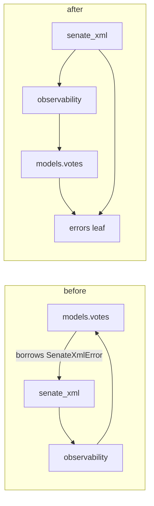

# Untangle `concord.models` from the `senate_xml` client (layering fix)

> Give the Senate-vote parse path a dependency-free error type in a new `concord/errors.py` leaf, so the data layer (`concord.models.votes`) stops importing a network client (`concord.senate_xml`) — removing the lazy-import workaround that PR #122 used to paper over the cycle.

## Source

- GitHub issue: [#123 — Untangle concord.models from the senate_xml client (layering + façade follow-up)](https://github.com/johnmarcampbell/concord/issues/123)
- Originating PR: [#122 — fan out the Scrape Run ledger](https://github.com/johnmarcampbell/concord/pull/122) (introduced the lazy-import workaround this plan removes)
- This is **plan 1 of 2** for issue #123. Plan 2 (the codebase-wide import-convention sweep) is [internal-import-convention.md](internal-import-convention.md) and is **sequenced after** this one.

## Context

PR #122 instrumented `senate_xml.py` to record into the observability ledger (ADR 0021), which made it import `concord.observability` → `concord.models`. But `concord.models.votes` already imported `concord.senate_xml` to borrow the `SenateXmlError` exception type inside `SenateVoteDetail.from_senate_xml`. That closed the cycle `models → votes → senate_xml → observability → models`.

#122 unblocked itself by **lazy-importing** `SenateXmlError` inside the method ([votes.py:368](../../src/concord/models/votes.py)) plus a regression guard in [tests/test_import_cycles.py](../../tests/test_import_cycles.py). That works, but it papers over the real smell: a **layering inversion**. `concord.models.votes` is a domain/data-layer module; `concord.senate_xml` is an HTTP client. The data layer should not depend on a network client — and it only does so to reuse one exception class. ADR 0018 deliberately put the senate.gov XML parsing *on the model* (Rule 2 — the `from_<source>` factory owns the parse in one place); the parser borrowed the client's error class instead of owning a dependency-free one.

This plan fixes that edge structurally. It is the higher-payoff, smaller half of issue #123. The façade question (issue smell #2) is handled separately in plan 2.

Domain terms (Vote, `SenateVoteDetail`, wire-shape/domain model, snapshot envelope) are defined in [CONTEXT.md](../../CONTEXT.md) and [ADR 0018](../adr/0018-pydantic-at-the-load-boundary.md).

## Goals

1. `concord.models` and all its submodules import **no** network client (`api`, `text`, `senate_xml`) at module load time.
2. `SenateXmlError` lives in a dependency-free leaf module that both the client and the model can import top-level.
3. The lazy `from concord.senate_xml import SenateXmlError` inside `SenateVoteDetail.from_senate_xml` reverts to a clean top-level import; the `# noqa: PLC0415` is gone.
4. `tests/test_import_cycles.py` still passes — and the workaround it was guarding no longer exists.
5. `ruff` / `mypy src` / `pytest` all green.

## Non-goals

1. **Touching the `concord.models/__init__.py` façade or rewriting any `from concord.models import …` call sites.** That is plan 2 ([internal-import-convention.md](internal-import-convention.md)). This plan changes the *definition site* of one exception, not the import convention.
2. **Renaming `SenateXmlError`.** The client still raises it for network/HTTP/HTML-trap failures and the model raises it for XML-parse failures; one shared type for "something went wrong getting or parsing Senate XML" is intentional. Keep the name.
3. **Flipping ruff's relative-import setting** or autofixing relative imports. Also plan 2.
4. **Any behaviour change.** Same exceptions raised at the same call sites; this is a pure move + import-path change.

## Relevant prior decisions

- [ADR 0018 — Pydantic validation at the load boundary](../adr/0018-pydantic-at-the-load-boundary.md). Rule 2 collocates `SenateVoteDetail.from_senate_xml` on the model; this plan keeps that, it only changes which module the error class comes from. The issue flags ADR 0018 as the "model/error ownership" anchor — no amendment is required (the model still owns the parse; the error simply moves to a neutral leaf), but note it in the PR description.
- [ADR 0021 — Scrape-run observability](../adr/0021-scrape-run-observability.md). The ledger edges (`senate_xml → observability → models`) are the second half of the cycle and are correct; this plan does not touch them.
- [ADR 0014 — Publish to PyPI as `congress-concord`, CLI-first](../adr/0014-publish-to-pypi-cli-first.md). Python imports are best-effort, not the stable contract — so repointing an internal import path (incl. in tests) needs no deprecation dance.

No new ADRs for this plan.

## Relevant files and code

- `src/concord/senate_xml.py:71` — current definition site of `class SenateXmlError(Exception)`. Also raises it at lines 175/187/195/204/211/337, and lists it in `__all__` (line 347).
- [src/concord/models/votes.py:344](../../src/concord/models/votes.py) — `SenateVoteDetail.from_senate_xml`; the lazy import is at line 368 (`# noqa: PLC0415`), the docstring reference at lines 359–361, and the raises at 373/382.
- `src/concord/models/_common.py` — dependency-free model leaf (stdlib + pydantic only). **Considered and rejected** as the error's home (see Approach).
- [tests/test_import_cycles.py](../../tests/test_import_cycles.py) — the regression guard; must still pass.
- `tests/test_scraper_votes.py:21` — `from concord.senate_xml import SenateClient, SenateXmlError`.
- `tests/test_senate_xml_recording.py:19` — `from concord.senate_xml import _HTML_TRAP_MARKER, SenateClient, SenateXmlError`.
- `src/concord/errors.py` — **new file** this plan creates.

## Approach

Create a new top-level leaf module `concord/errors.py` holding `SenateXmlError`. Both `concord.senate_xml` (which raises it for network/HTTP/HTML-trap failures) and `concord.models.votes` (which raises it for XML-parse failures) import it from there. The `models → senate_xml` edge disappears structurally, and the lazy import reverts to a normal top-level one.

**Why `concord/errors.py` and not `concord/models/_common.py`?** Both are dependency-free leaves, and the issue offers either. But `_common.py` holds model utility *types* (`Chamber`, `SessionNumber`, `Snapshot`) — a network/parse error is out of place there. More importantly, putting the error under the `models` package would force the network client to do `from concord.models._common import SenateXmlError` — a client reaching into the domain layer's private module for its own exception. That just inverts the smell in the other direction. A neutral top-level `concord/errors.py` is a foundational leaf that *both* layers sit above, importing downward. It's also the obvious home for any future shared exception.

**Why keep one shared `SenateXmlError` rather than give the model its own type?** The Senate-vote loader fetches via the client (raises `SenateXmlError` on HTTP/HTML failures) and parses via the model (raises `SenateXmlError` on malformed XML). A single exception class lets the loader's `except SenateXmlError` cover "anything wrong with a Senate vote from senate.gov" in one clause. Splitting into two types would be churn for negative value.

**Cycle check after the change.** `concord.errors` imports nothing but `Exception`. So `models.votes → errors` and `senate_xml → errors` both terminate at a leaf. The old cycle is cut at the `votes → senate_xml` edge. The `senate_xml → observability → models` edges remain (correct and unchanged).

## Step-by-step plan

1. **Create the leaf module.** Add `src/concord/errors.py` containing `class SenateXmlError(Exception)` — move the class body (and its docstring) verbatim from `senate_xml.py:71`. Give the module a short docstring: dependency-free home for cross-layer exceptions; importing it must pull in nothing but the stdlib. Add `__all__ = ["SenateXmlError"]`. Verify the file imports cleanly: `uv run python -c "import concord.errors"`.

2. **Repoint the client.** In `src/concord/senate_xml.py`: delete the `class SenateXmlError` definition (line 71), add `from concord.errors import SenateXmlError` to the top-level imports, and remove `"SenateXmlError"` from the module's `__all__` (line 347). The six `raise SenateXmlError(...)` sites are unchanged. Verify: `uv run python -c "import concord.senate_xml"`.

3. **Revert the lazy import in the model.** In `src/concord/models/votes.py`, delete the lazy import block at line 368 (including the `# noqa: PLC0415` and its explanatory comment, lines ~363–368) and add `from concord.errors import SenateXmlError` to the top-level imports. Update the `from_senate_xml` docstring reference (lines ~359–361) from `concord.senate_xml.SenateXmlError` to `concord.errors.SenateXmlError`. The two `raise SenateXmlError(...)` sites (lines 373, 382) are unchanged.

4. **Repoint the two test imports.** In `tests/test_scraper_votes.py:21` and `tests/test_senate_xml_recording.py:19`, split the import so `SenateXmlError` comes from `concord.errors` while `SenateClient` / `_HTML_TRAP_MARKER` stay on `concord.senate_xml`. E.g. `from concord.senate_xml import SenateClient` + `from concord.errors import SenateXmlError`.

5. **Verify no other models submodule imports a client.** Run `grep -rEn "import concord\.(api|text|senate_xml)|from concord\.(api|text|senate_xml)" src/concord/models/` and confirm it returns nothing. (Goal 1.)

6. **Run the gates.** `uv run ruff check && uv run ruff format --check && uv run mypy src && uv run pytest` — all green. Confirm `tests/test_import_cycles.py` passes specifically with each module as a first import.

## Demo seed data

Not applicable — pure refactor, no new tables, columns, entities, or API capabilities.

## Testing strategy

- **Regression — import cycles:** `tests/test_import_cycles.py` must stay green; it imports each of `senate_xml`, `observability`, `models`, `text`, `api` first in a clean subprocess. This is the load-bearing check.
- **Regression — Senate parse path:** `tests/test_scraper_votes.py` and `tests/test_senate_xml_recording.py` exercise `from_senate_xml` and the client's error raises; they must pass with the repointed import. Confirm a malformed-XML case still raises `SenateXmlError` (now from `concord.errors`).
- **No new tests required** — behaviour is unchanged. Optionally add a one-line assertion that `concord.errors.SenateXmlError is concord.senate_xml.SenateXmlError` to pin the shared-identity contract, but it's not necessary.
- **Manual:** none.

## Acceptance criteria

- [ ] `src/concord/errors.py` exists, defines `SenateXmlError`, and imports nothing outside the stdlib.
- [ ] `grep` confirms no module under `src/concord/models/` imports `concord.api`, `concord.text`, or `concord.senate_xml`.
- [ ] `votes.py`'s `from_senate_xml` has a top-level `from concord.errors import SenateXmlError` and no `# noqa: PLC0415`.
- [ ] `senate_xml.py` raises the imported `SenateXmlError`; the class is no longer defined or `__all__`-exported there.
- [ ] `tests/test_import_cycles.py` passes; the lazy-import workaround it guarded is gone.
- [ ] `uv run ruff check`, `uv run ruff format --check`, `uv run mypy src`, and `uv run pytest` are all green.

## Open questions

None — all design decisions resolved during grilling (leaf location, shared-vs-split error type, naming all decided above).

## Out-of-band work

- **Blocks plan 2.** [internal-import-convention.md](internal-import-convention.md) (the façade sweep) should land **after** this PR. Both plans touch `senate_xml.py` (this one changes the `SenateXmlError` import; plan 2 autofixes `senate_xml.py`'s relative imports and rewrites `from .models import Attempt`). Different lines, but sequencing this first avoids a rebase tangle and lets plan 2's new ADR reference the resolved layering rather than an open problem.
