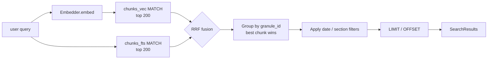

# Web layer — public-facing search demo

> A small FastAPI + Jinja2 + HTMX app served from the VPS, reading the SQLite store the pipeline built. Search box, ranked results with snippets, single-proceeding view, and date / section filters. The "lens" frontend per ADR-0001.

## Source

- Architecture decisions resolved during the same `grill-with-docs` session as Stages 1 and 2 (2026-05-24). Relevant outputs:
  - [CONTEXT.md](../../CONTEXT.md) — domain glossary, including the *Web* component description and the *Hybrid search* / *RRF* / *Chunk* definitions.
  - [ADR-0001 — Python end-to-end for the web layer](../adr/0001-python-end-to-end-for-the-web-layer.md). Locks in the stack and the "lens, not showpiece" posture.
  - [ADR-0003 — SQLite as the derived store](../adr/0003-sqlite-as-derived-store.md). Determines the data access model — single SQLite file, WAL mode, fresh connection per request.
  - [ADR-0004 — OpenAI for embeddings](../adr/0004-openai-embeddings.md). The same `Embedder` used in Stage 2 is reused here to embed user queries at query time.
  - [ADR-0005 — Chunks as the unit of retrieval](../adr/0005-chunks-as-unit-of-retrieval.md). Both indexes return chunks; this layer rolls them up to proceedings for display.
- Prerequisites: [Stage 1 — Load](./stage-1-load.md) and [Stage 2 — Index](./stage-2-index.md). The web layer reads the `proceedings`, `chunks`, `chunks_fts`, and `chunks_vec` tables those stages produce.
- No GitHub issue exists yet. File one before starting if you want PR / branch tracking.

## Context

After Stages 1 and 2, `proceedings.db` holds everything a search engine needs: metadata, full text, chunks, an FTS5 keyword index, and a `sqlite-vec` vector index. Nothing currently exposes those to a user. The web layer is what turns the database into a thing a person — specifically a resume reviewer hitting a URL — can use in 30 seconds without instructions.

The product scope was pinned during grilling and is intentionally narrow:

1. **One search box.** Text query, optional date range, optional section filter.
2. **A ranked results list.** Each result is a proceeding with its title, date, section, page range, and a snippet from its best-matching chunk.
3. **A single-proceeding view.** Full text, full metadata sidebar, link to the official `congress.gov` page and PDF.

Out of scope for this plan: anything resembling a knowledge graph UI (Stage 3 territory), user accounts, saved searches, side-by-side comparison views, fancy visualizations. Those are explicitly deferred per ADR-0001's "lens, not showpiece" framing.

The deploy target is a 4 GB Hostinger KVM1 VPS. Hostinger handles TLS termination upstream of the app, so the app speaks plain HTTP on a private port. The web process runs alongside the cron-driven scraper / loader / indexer; the SQLite file is the only shared state, and SQLite's WAL mode handles the concurrent-read-while-write story automatically.

## Goals

1. A FastAPI app, package layout under `src/concord/web/`, with three real routes (`/`, `/search`, `/proceedings/{granule_id}`) plus a `/healthz` for ops.
2. A query layer (`src/concord/web/search.py`) that performs hybrid retrieval — embeds the user's query via the existing `Embedder`, runs FTS5 and `sqlite-vec` queries against `chunks`, fuses results via Reciprocal Rank Fusion, groups by `granule_id`, and returns the top N proceedings with their best-matching chunk for snippet display.
3. A small Jinja2 + HTMX + Tailwind UI that supports the search → results → doc-view flow, with date-range and section filters, and partial-update results via HTMX so typing a new query doesn't full-page-reload.
4. Per-IP rate limiting on the search endpoint (the only endpoint that calls OpenAI) to bound abuse cost.
5. A new CLI command `concord serve --db PATH [--host HOST] [--port PORT] [--reload]` that boots the app via uvicorn.
6. A systemd unit and a brief deployment note covering the Hostinger reverse-proxy setup.
7. Tests covering: the RRF algorithm in isolation, the query layer end-to-end against a small seeded DB, every route's status code + smoke content via FastAPI's `TestClient`, and the CLI command's flag parsing.

## Non-goals

1. **User accounts, auth, sessions, bookmarks, saved searches.** Anonymous-only. Stateless beyond rate-limit buckets.
2. **Knowledge-graph UI / entity browsing.** Stage 3 territory. The schema this layer queries doesn't include `entities` or `mentions` yet.
3. **Real-time updates** during long ingest runs. The data updates roughly daily via cron; the user doesn't need a live notification when new proceedings land.
4. **Server-side caching / CDN.** Premature for the expected traffic profile (low, bursty, mostly from people clicking the resume link).
5. **Build pipeline for Tailwind.** Use the Tailwind Play CDN. ADR-0001 explicitly rules out a JS / CSS build step. The aesthetic ceiling is "clean, readable, mobile-OK," not "pixel-perfect production design."
6. **Multi-worker uvicorn / async-everywhere.** Single worker is enough for our traffic, and SQLite's single-writer model means extra workers add complexity for no gain on the read path. The app uses sync route handlers — keeping `sqlite3` calls in the calling thread is simpler than juggling `asyncio` and connection pooling.
7. **Internationalization, accessibility audit, SEO tags beyond basics.** Not the project's purpose.
8. **A standalone Node / React frontend.** Explicitly deferred per ADR-0001. Reversing this decision is a separate plan.

## Relevant prior decisions

- **ADR-0001 — Python end-to-end** ([docs/adr/0001-python-end-to-end-for-the-web-layer.md](../adr/0001-python-end-to-end-for-the-web-layer.md)). Determines the stack: FastAPI, Jinja2, HTMX (CDN), Tailwind (CDN). No JS build step. Same repo, same Python process as the pipeline.
- **ADR-0003 — SQLite as the derived store** ([docs/adr/0003-sqlite-as-derived-store.md](../adr/0003-sqlite-as-derived-store.md)). Determines that the web app reads from the same `proceedings.db` the pipeline writes, in WAL mode. Fresh connection per request — see Approach.
- **ADR-0004 — OpenAI for embeddings** ([docs/adr/0004-openai-embeddings.md](../adr/0004-openai-embeddings.md)). Same model (`text-embedding-3-small`) used at query time as at indexing time. Required for vector-space alignment.
- **ADR-0005 — Chunks as the unit of retrieval** ([docs/adr/0005-chunks-as-unit-of-retrieval.md](../adr/0005-chunks-as-unit-of-retrieval.md)). Both indexes operate on chunks; results roll up to proceedings via `GROUP BY granule_id`.
- **Stage 1 plan** ([docs/plans/stage-1-load.md](./stage-1-load.md)) and **Stage 2 plan** ([docs/plans/stage-2-index.md](./stage-2-index.md)). Define `SqliteStorage` and the `chunks` / `chunks_fts` / `chunks_vec` tables this layer queries. This plan must not modify the schema either of those plans created — it is read-only over their output.

## Relevant files and code

Paths verified (existing or to-be-created in earlier stages):

- `src/concord/storage/sqlite.py` *(created in Stage 1, extended in Stage 2)* — `SqliteStorage`. The web app uses it to open SQLite connections; it does not write through it.
- `src/concord/embedding.py` *(created in Stage 2)* — `Embedder`. Reused by the query layer to embed each user query.
- `src/concord/chunking.py` *(created in Stage 2)* — `Chunk` model. Used as the unit returned by the query layer before roll-up.
- `src/concord/models.py` — `Proceeding`. The roll-up unit returned to the UI.
- `src/concord/cli.py` — Typer app. Add `@app.command("serve")` here.
- `pyproject.toml` — add `fastapi`, `uvicorn[standard]`, `jinja2`, `slowapi`.

New files this plan creates:

- `src/concord/web/__init__.py` — empty marker.
- `src/concord/web/app.py` — FastAPI app construction, routes, middleware, template setup.
- `src/concord/web/search.py` — `search(db, query, *, date_from, date_to, section, limit) -> SearchResults`. Pure function over a `sqlite3.Connection`; no FastAPI knowledge.
- `src/concord/web/snippets.py` — small helper to build display snippets from chunks (uses FTS5's `snippet()` for keyword-matched chunks; truncate-around-middle for semantic-only).
- `src/concord/web/templates/base.html` — layout (header with search box, footer, Tailwind + HTMX script tags).
- `src/concord/web/templates/index.html` — landing page (empty state, just the search box).
- `src/concord/web/templates/_results.html` — HTMX partial: ordered list of result cards + pagination.
- `src/concord/web/templates/_result_card.html` — one proceeding in the result list.
- `src/concord/web/templates/proceeding.html` — full document view.
- `src/concord/web/templates/404.html` — for unknown granule IDs.
- `src/concord/web/static/style.css` — minimal custom CSS for things Tailwind can't easily express (e.g. mark highlight color tuning).
- `tests/test_web_search.py` — unit tests for the query layer + RRF.
- `tests/test_web_routes.py` — integration tests via FastAPI's `TestClient`.

## Approach

### Stack and rendering model

FastAPI for routing and request handling; Jinja2 for HTML rendering via `fastapi.templating.Jinja2Templates`. Each route returns either a full HTML page (direct navigation) or a partial fragment (HTMX request). The partial / full decision is one line per route: check `request.headers.get("HX-Request")` and pick the template accordingly.

HTMX is included as a `<script src="https://unpkg.com/htmx.org@2">` tag in `base.html`. Tailwind via the Play CDN: `<script src="https://cdn.tailwindcss.com">`. Neither requires a build step, neither needs `npm`, and both are explicitly fine for the demo per ADR-0001's "lens" framing.

The search box is in the header on every page. Submitting it does an `hx-get="/search"` with `hx-target="#results"` and `hx-push-url="true"`, so:
- Typing a query → results update in place
- The URL changes to `/search?q=...` so it's shareable / bookmarkable
- Back button restores the previous query

Direct navigation to `/search?q=...` returns a full page (header + results), so links work even if HTMX hasn't loaded.

### Data access model

Per ADR-0003, WAL mode + fresh connection per request. Implementation: a FastAPI dependency `get_db()` that opens a `sqlite3.Connection` to the configured DB path, yields it, and closes on response completion. The pipeline's WAL writes don't block these reads.

```python
def get_db(request: Request) -> Iterator[sqlite3.Connection]:
    conn = sqlite3.connect(request.app.state.db_path, isolation_level=None)
    conn.row_factory = sqlite3.Row
    # Load sqlite-vec extension for vector search.
    conn.enable_load_extension(True)
    sqlite_vec.load(conn)
    conn.enable_load_extension(False)
    try:
        yield conn
    finally:
        conn.close()
```

The `Embedder` is constructed once at app startup (it just wraps an `openai.OpenAI` client) and stashed on `app.state.embedder`. Routes read it via a small `get_embedder` dependency.

### The search query

The query layer is one pure function:

```python
def search(
    db: sqlite3.Connection,
    embedder: Embedder,
    *,
    query: str,
    date_from: date | None = None,
    date_to: date | None = None,
    section: str | None = None,
    limit: int = 20,
    offset: int = 0,
) -> SearchResults: ...
```

It does the following:

1. **Embed the query** via `embedder.embed([query])[0]` → 1536-dim vector. (One OpenAI call per search request; this is what the rate limiter protects.)
2. **Run two retrievals over chunks, each limited to top 200:**
   - FTS5: `SELECT rowid, rank FROM chunks_fts WHERE chunks_fts MATCH ? ORDER BY rank LIMIT 200`
   - Vec: `SELECT rowid, distance FROM chunks_vec WHERE embedding MATCH ? AND k = 200`
3. **Fuse with RRF** in Python: `score(chunk_id) = Σ 1 / (60 + rank_in_each_list)`. (Pure-SQL RRF is possible with CTEs and `UNION`, but SQLite lacks `FULL OUTER JOIN`, and the Python version is ~10 lines and obvious.)
4. **Roll up to proceedings:** for each chunk in the fused ranking, look up its `granule_id`. Keep the highest-scoring chunk per proceeding; that chunk supplies the snippet. The proceeding's RRF score is its best chunk's score.
5. **Apply metadata filters** (date range, section) as a final SQL `WHERE` clause when joining back to `proceedings`. Filters can't precede retrieval because they'd defeat the FTS5/vec rank cutoff; applying them after is slightly wasteful but correct, and our `LIMIT 200` per signal gives plenty of headroom.
6. **Page the result set** with `limit` / `offset` and return a `SearchResults` object with: list of `ProceedingResult`s (proceeding metadata + best chunk + snippet), total count, current offset, page size.



### Snippets

For each result, build a display snippet from its best-matching chunk:

- **If the chunk came from FTS5 (rank > 0 in the FTS list)**: use FTS5's built-in `snippet()` function — `SELECT snippet(chunks_fts, 0, '<mark>', '</mark>', '…', 32) FROM chunks_fts WHERE rowid = ? AND chunks_fts MATCH ?`. Returns ~32 tokens of context around the matched terms with `<mark>` highlights.
- **If the chunk only came from vec (semantic-only match)**: take the chunk's text, truncate to ~240 chars from the center, prepend/append `…` as needed. No highlights.
- Strip the snippet of leading/trailing whitespace and collapse runs of whitespace.

All snippet HTML is escaped except the `<mark>` tags FTS5 emits (which are produced from a server-controlled allowlist of safe tags).

### Routes

| Method | Path                              | Returns                                     |
| ------ | --------------------------------- | ------------------------------------------- |
| GET    | `/`                               | `index.html` (full page, just the search box) |
| GET    | `/search`                         | `_results.html` partial if HTMX, full search-results page otherwise |
| GET    | `/proceedings/{granule_id}`       | `proceeding.html` (full doc view), 404 if unknown |
| GET    | `/healthz`                        | `{"ok": true}` JSON, no DB hit              |
| GET    | `/static/{path}`                  | Static files (CSS)                          |

The `/search` endpoint takes query params `q`, `from`, `to`, `section`, `page`. All optional; missing `q` returns the empty-state results template.

### Rate limiting

`slowapi` with a per-IP limit of `30/minute` on `/search` only. The other routes (no OpenAI calls, just SQLite reads) are unlimited. Add a `403 Forbidden`-equivalent response template (`_rate_limited.html`) for when the limit hits — friendly message, not a stack trace.

Combine with an OpenAI account-level monthly spend cap as belt-and-suspenders. Document setting this in the deployment notes.

### CLI: `concord serve`

```
concord serve --db PATH [--host HOST] [--port PORT] [--reload]
```

- `--db PATH` (required) — path to `proceedings.db`
- `--host HOST` (default `127.0.0.1`) — bind address. The deployment binds to `127.0.0.1` and Hostinger's reverse proxy forwards from the public interface.
- `--port PORT` (default `8000`)
- `--reload` (default `False`) — uvicorn auto-reload, dev only

Reads `OPENAI_API_KEY` from env. Same clean-exit pattern as the other commands when missing.

Implementation: import `concord.web.app:create_app`, call it with the resolved config, hand to `uvicorn.run(app, host=..., port=..., reload=...)`.

### Deployment notes

Capture these in a new top-level `docs/deployment.md` (or append to README) so the executor's smoke test ends with a real running deploy, not just a localhost demo:

1. **systemd unit at `/etc/systemd/system/concord-web.service`:**
   ```ini
   [Unit]
   Description=Concord web demo
   After=network.target

   [Service]
   Type=simple
   User=concord
   WorkingDirectory=/opt/concord
   ExecStart=/opt/concord/.venv/bin/concord serve --db /var/lib/concord/proceedings.db --host 127.0.0.1 --port 8000
   Environment="OPENAI_API_KEY=…"
   Restart=on-failure
   RestartSec=5

   [Install]
   WantedBy=multi-user.target
   ```

2. **Hostinger reverse-proxy** pointed at `127.0.0.1:8000`. TLS terminates upstream — the app never sees HTTPS.

3. **OpenAI spend cap** set at the account level to bound worst-case bot abuse cost.

4. **Cron entries** for `concord pull`, `concord load`, `concord index` (these belong in the pipeline plans but the web deploy doc should at least mention they're separate).

## Step-by-step plan

1. **Add web-layer runtime dependencies to `pyproject.toml`.** Append to `dependencies`: `"fastapi>=0.115"`, `"uvicorn[standard]>=0.30"`, `"jinja2>=3.1"`, `"slowapi>=0.1.9"`. Run `uv sync` and confirm install succeeds.

2. **Scaffold the web package.** Create `src/concord/web/__init__.py` (empty), `src/concord/web/templates/`, `src/concord/web/static/`. Add `[tool.hatch.build.targets.wheel.shared-data]` or `[tool.hatch.build.targets.wheel.force-include]` to `pyproject.toml` so the templates and static directories ship with the installed package (verify with `uv build && unzip -l dist/concord-*.whl | grep templates`).

3. **Implement `src/concord/web/search.py`.** Pure-Python query layer as described in Approach. `SearchResults` and `ProceedingResult` as Pydantic models (consistent with the rest of the project). `search()` takes injected `sqlite3.Connection` and `Embedder`, so it's trivially testable. Do RRF in Python, not SQL.

4. **Implement `src/concord/web/snippets.py`.** Two helpers: `keyword_snippet(conn, chunk_id, query) -> str` calls FTS5's `snippet()`; `semantic_snippet(chunk_text) -> str` truncates around the middle. Both return a string with `<mark>…</mark>` allowed but everything else HTML-escaped.

5. **Implement `src/concord/web/app.py`.**
   - `create_app(db_path: Path) -> FastAPI` factory. Stash `db_path` on `app.state`. Construct an `Embedder` once at startup using `openai.OpenAI()` and stash on `app.state.embedder`. Mount `StaticFiles(directory=…/static)` at `/static`. Configure `Jinja2Templates(directory=…/templates)`.
   - `get_db(request)` and `get_embedder(request)` dependencies.
   - Routes: `index`, `search`, `proceeding`, `healthz`. Each handler is a sync function (no `async def`); FastAPI runs them in a threadpool, which keeps SQLite calls on a real thread.
   - `slowapi` configured with per-IP key, `30/minute` limit applied via decorator to the `search` handler only.
   - Exception handler for `404 Not Found` on `/proceedings/{granule_id}` that renders `404.html` instead of FastAPI's JSON default.

6. **Write the templates.** Start with `base.html` (header with search form, footer, Tailwind + HTMX `<script>` tags). Then `index.html`, `_result_card.html`, `_results.html`, `proceeding.html`, `404.html`, `_rate_limited.html`. Keep the design minimal: a centered column, large legible type, monospace for the text body, snippet `<mark>` highlights with a soft yellow background.

7. **Add `concord serve` to `src/concord/cli.py`.** New `@app.command("serve")` mirroring the existing `pull_command` structure. Imports `concord.web.app.create_app` lazily (inside the handler) so `concord --help` doesn't pay the FastAPI/uvicorn import cost. Exits 2 with a clear message if `OPENAI_API_KEY` is missing, matching the existing pattern.

8. **Unit tests in `tests/test_web_search.py`.** Cover the query layer in isolation against a small seeded DB (use a tmp `proceedings.db` populated via `SqliteStorage` + handful of chunks). Inject a stub `Embedder` that returns canned vectors so no network is needed. Cases:
   - `test_pure_fts_query_returns_keyword_matches` — query string that no embedding can help with (gibberish), assert FTS matches still surface.
   - `test_pure_semantic_query_returns_vec_matches` — query that doesn't lexically match anything, assert vec results surface via RRF.
   - `test_hybrid_query_merges_signals` — query that matches both ways; assert the merged ranking outperforms either alone (e.g., a chunk that ranks in both lists ranks higher than chunks in only one).
   - `test_results_grouped_by_proceeding` — multi-chunk-match proceeding appears once, with the best chunk's snippet.
   - `test_date_filter_excludes_out_of_range` — proceedings outside `date_from`/`date_to` don't appear.
   - `test_section_filter_excludes_other_sections` — `section="Senate Section"` drops House results.
   - `test_pagination_offset_works` — `offset=20` returns results 21–40.
   - `test_empty_query_returns_empty_results` — no DB queries issued, embedder not called.

9. **Unit tests for snippets in `tests/test_web_search.py` or split `tests/test_web_snippets.py`.** Cover keyword snippet generation (FTS5 `snippet()` shape, `<mark>` highlights present), semantic-only truncation (length, ellipses), HTML-escape behavior (`<script>` in chunk text doesn't leak).

10. **Integration tests in `tests/test_web_routes.py` via `fastapi.testclient.TestClient`.**
    - `test_index_renders` — `GET /` returns 200 and contains the search box element.
    - `test_search_full_page` — `GET /search?q=...` (no `HX-Request` header) returns full HTML (with `<html>`).
    - `test_search_partial` — `GET /search?q=...` with `HX-Request: true` returns the partial template (no `<html>`).
    - `test_search_with_filters` — `?from=2026-01-01&to=2026-05-22&section=Senate%20Section` passes filters through.
    - `test_proceeding_detail` — `GET /proceedings/{known_granule_id}` returns 200, includes the proceeding's title and text.
    - `test_proceeding_not_found` — unknown granule returns the custom 404 template, status 404.
    - `test_healthz` — returns 200 with `{"ok": true}`.
    - `test_rate_limit_search` — issue 31 search requests in under a minute, assert the 31st returns 429.
    - `test_static_css_served` — `GET /static/style.css` returns 200.

11. **CLI tests in `tests/test_cli.py`.** New `TestServeCommand` class:
    - `test_help_lists_all_flags` — `--db`, `--host`, `--port`, `--reload` appear (using `_strip` for ANSI).
    - `test_missing_openai_api_key_exits_cleanly` — unset env, expect exit 2 with `OPENAI_API_KEY` in the error.
    - `test_missing_db_file_exits_cleanly` — `--db /does/not/exist` exits 2 with a clear message (don't crash inside uvicorn).
    - Skip an actual `uvicorn.run` test; trust that uvicorn boots correctly. Verify the wiring up to `uvicorn.run` via monkeypatching it.

12. **Write deployment notes.** New file `docs/deployment.md` with: systemd unit example (verbatim), Hostinger reverse-proxy pointer, OpenAI spend-cap instructions, cron suggestions for the pipeline. Link from README.

13. **Run the full local CI suite and fix anything that breaks.** `uv sync && uv run ruff check && uv run ruff format --check && uv run mypy src && uv run pytest`. All pre-existing tests (Stages 1 + 2) must still pass. New tests bring the total up by ~25.

14. **End-to-end local smoke test.** With `OPENAI_API_KEY` and a `proceedings.db` populated by `concord load` + `concord index` against a 1-day pull (~20 proceedings):
    ```
    uv run concord serve --db /tmp/concord_demo.db --reload
    ```
    Visit `http://127.0.0.1:8000/`. Verify:
    - The search box renders with Tailwind styling.
    - A search for a likely-present term (e.g. "senate") returns ranked results with snippets.
    - Clicking a result shows the full proceeding view with metadata sidebar.
    - The date and section filters narrow the results.
    - Typing a new query updates results in place without a full reload (network panel: only the `/search` request, no top-level navigation).
    - `curl -s http://127.0.0.1:8000/healthz` returns `{"ok":true}`.

15. **VPS deploy smoke test.** (Optional for the first iteration; mandatory before sharing the URL.) Install the package on the VPS, drop a populated `proceedings.db` into `/var/lib/concord/`, drop the systemd unit, `systemctl enable --now concord-web`. Verify the public URL serves the same content as the local smoke test. Confirm Hostinger's TLS works end-to-end.

## Demo seed data

Not applicable. Concord doesn't have a demo-mode pattern or a `seed.sql` file. The closest equivalent is a small `proceedings.db` produced by running `concord pull --limit 5 → load → index` against the live API, which is what the smoke tests use; not committed.

## Testing strategy

**Unit tests, new files:**
- `tests/test_web_search.py` — query layer against a tmp DB with seeded data and stubbed `Embedder`. ~10 tests. No network, no FastAPI.
- (Optional split) `tests/test_web_snippets.py` — snippet helpers in isolation.

**Integration tests, new file:**
- `tests/test_web_routes.py` — `TestClient` over the FastAPI app. ~10 tests. Uses a tmp DB seeded via `SqliteStorage` in fixtures.

**CLI tests, extending existing:**
- `tests/test_cli.py` — new `TestServeCommand` class. ~3 tests.

**Manual / smoke:** step 14 (local) and step 15 (production), the latter optional for iteration but mandatory before linking the URL anywhere.

**Regression risk:**
- No schema changes — this plan is read-only over the SQLite store. Stage 1 and Stage 2 tests must continue to pass unchanged.
- The `Embedder` API contract (`embed(texts: list[str]) -> list[list[float]]`) is reused here; if Stage 2 changes that signature, this plan adapts.

## Acceptance criteria

- [ ] `src/concord/web/{app,search,snippets}.py` exist with module docstrings.
- [ ] All six templates (`base`, `index`, `_results`, `_result_card`, `proceeding`, `404`) render without template errors.
- [ ] `GET /` renders the empty-state page with a working search box.
- [ ] `GET /search?q=...` returns results with proceeding metadata + snippets.
- [ ] `HX-Request: true` on `/search` returns only the partial fragment.
- [ ] `GET /proceedings/{known_granule_id}` returns the full doc view; unknown IDs return the custom 404.
- [ ] `GET /healthz` returns `{"ok": true}` with no DB access.
- [ ] Per-IP rate limit on `/search`: 31st request in a minute returns 429.
- [ ] Missing `OPENAI_API_KEY` exits 2 with a clean message, no traceback.
- [ ] `concord serve --help` shows `--db`, `--host`, `--port`, `--reload`.
- [ ] `uv run ruff check`, `uv run ruff format --check`, `uv run mypy src` all pass.
- [ ] `uv run pytest` passes — all pre-existing tests plus ~25 new ones.
- [ ] CI is green on the PR.
- [ ] Step 14's local smoke test succeeds.
- [ ] `docs/deployment.md` exists with the systemd unit, Hostinger pointer, and OpenAI spend-cap note.

## Open questions

- **Q: Tailwind via CDN, or precompiled?** CDN per ADR-0001's no-build-step framing. The trade-off: marginally slower first paint (~20 KB CSS download), no purge step (full Tailwind shipped). For demo traffic levels both are irrelevant. **Default: CDN.** If the unstyled-flash-of-content becomes annoying, revisit; precompiling adds ~one new dev dependency (`tailwindcss` CLI binary) and a `make css` step.

- **Q: `slowapi` vs custom middleware for rate limiting?** `slowapi` is small (~3 transitive deps) and battle-tested. Custom would be ~30 lines but means owning the storage / window logic. **Default: `slowapi`.** Acceptable to swap if its deps become a problem.

- **Q: Should the search endpoint cache results by `(query, filters)` key?** Caching is appealing because OpenAI's embed call is the dominant per-request cost, and repeated identical queries are common in demos. But caching adds state (in-memory dict, eviction, race conditions) that this layer otherwise avoids, and OpenAI embed costs are ~$0.00002/query. **Default: no cache.** Revisit if real traffic shows a high duplicate-query rate.

- **Q: Snippet length — characters or tokens?** FTS5's `snippet()` takes a token count (default 32 tokens). For the semantic-only path, "240 chars" is rough. **Default: 32 tokens for FTS5 snippets, ~240 chars (≈ 50 tokens) for semantic-only. Aligns the two visually without obsessing.**

- **Q: Should sync route handlers be `def` or `async def`?** All work is blocking (SQLite, OpenAI sync SDK call). `def` lets FastAPI dispatch to a threadpool, keeping the event loop free. `async def` would force us to wrap blocking calls in `run_in_executor` ourselves. **Default: `def` (sync).** Reconsider only if we ever introduce a route that does real concurrent I/O.

- **Q: How does the running web server pick up newly-loaded / re-indexed data?** WAL mode plus fresh-connection-per-request means new commits from the pipeline are visible on the *next* request. No server restart needed. Documented in `docs/deployment.md` step. **Default: nothing to build; this is automatic.** Verify in step 14 by running `concord load` against a new fixture while `concord serve` is up.

- **Q: What about long proceedings on the doc view — render all 50,000 tokens in one page?** Browsers handle large text fine, but it's slow on mobile. Truncation with "show full" is a future enhancement. **Default: render the full text. Mobile-slow is acceptable for v1.**

## Out-of-band work

- **Stage 3 (Enrich)** will add `entities` and `mentions` tables. When that lands, the web layer will likely gain entity-filter chips on the search results (e.g. "speaker = Warren") and an entity-detail view. Out of scope here; just don't bake assumptions into the query layer that would block adding entity joins later.
- **Domain + DNS** for the resume URL — not technical work this plan covers. Hostinger setup is the user's concern.
- **Analytics** — none in v1. If you want page-view counts later, add a privacy-friendly tracker (Plausible self-hosted, etc.) in a follow-up.
- **Backup of `proceedings.db`** — the file is regenerable from JSONL (per ADR-0002), but the JSONL itself needs backup. Out of scope here; mention in deployment notes.
